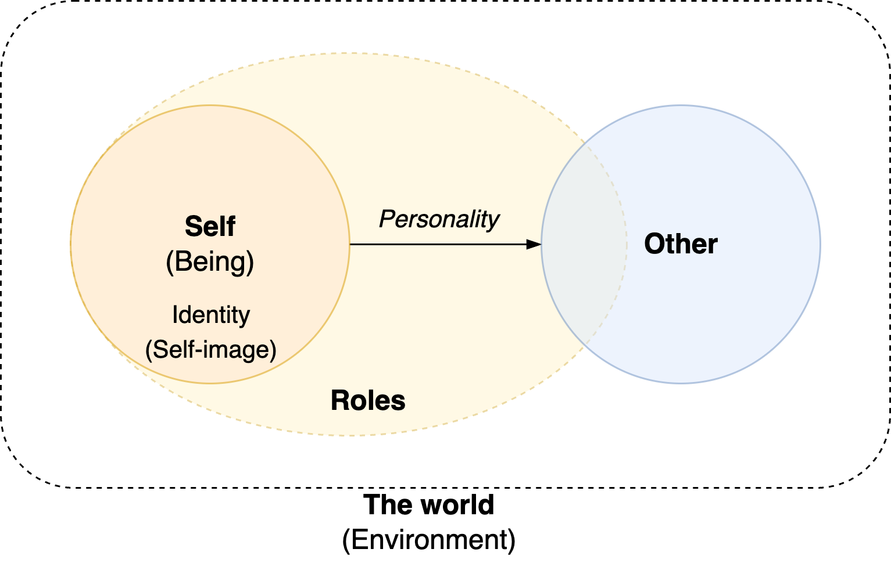
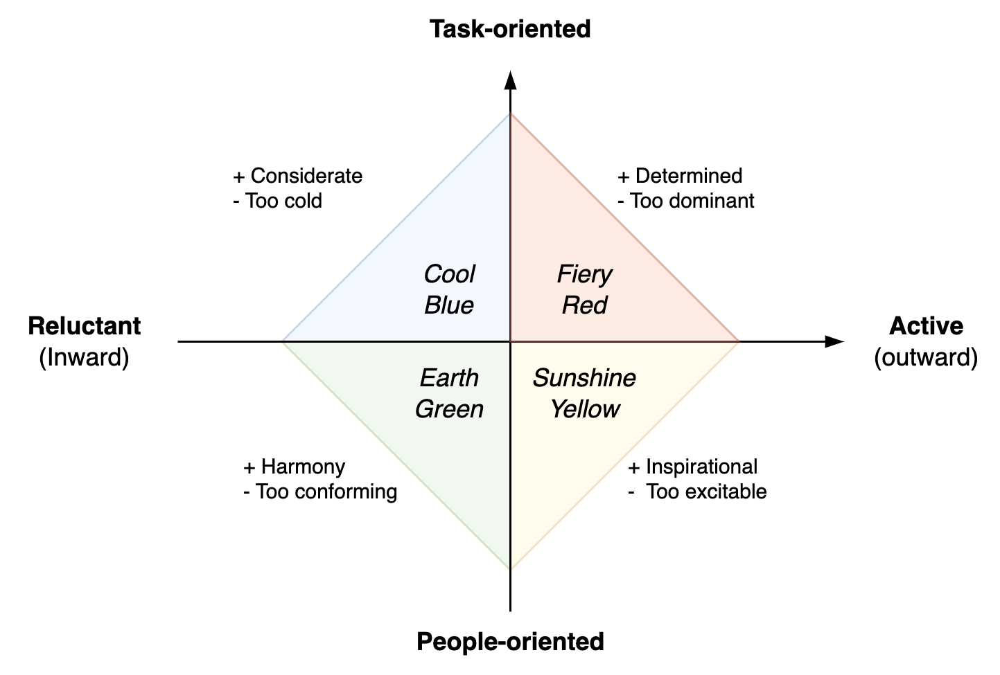
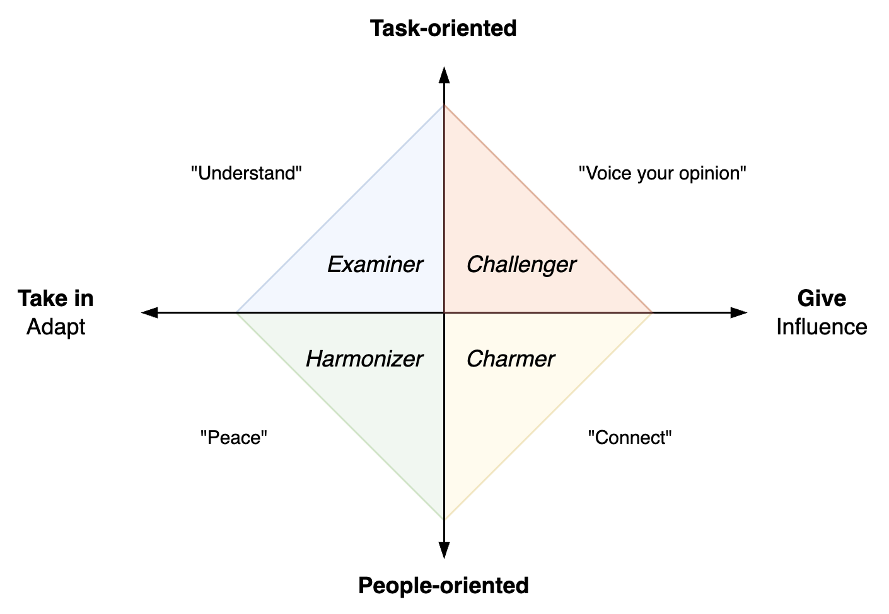
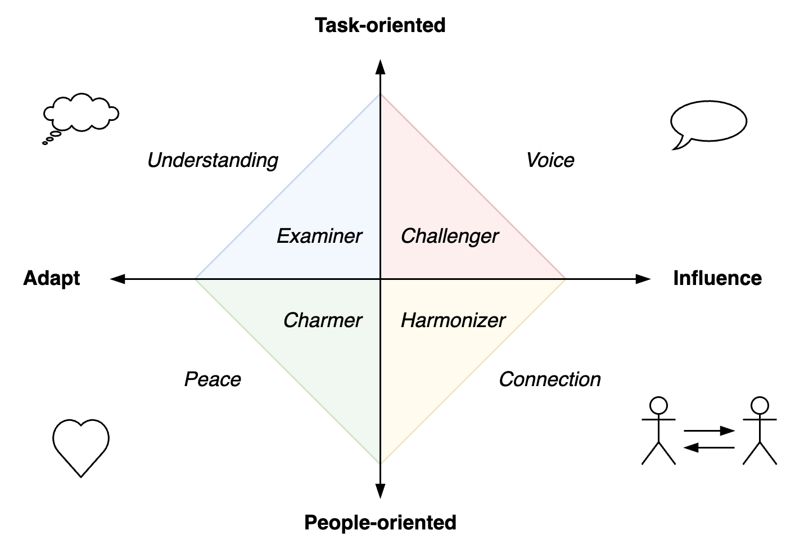
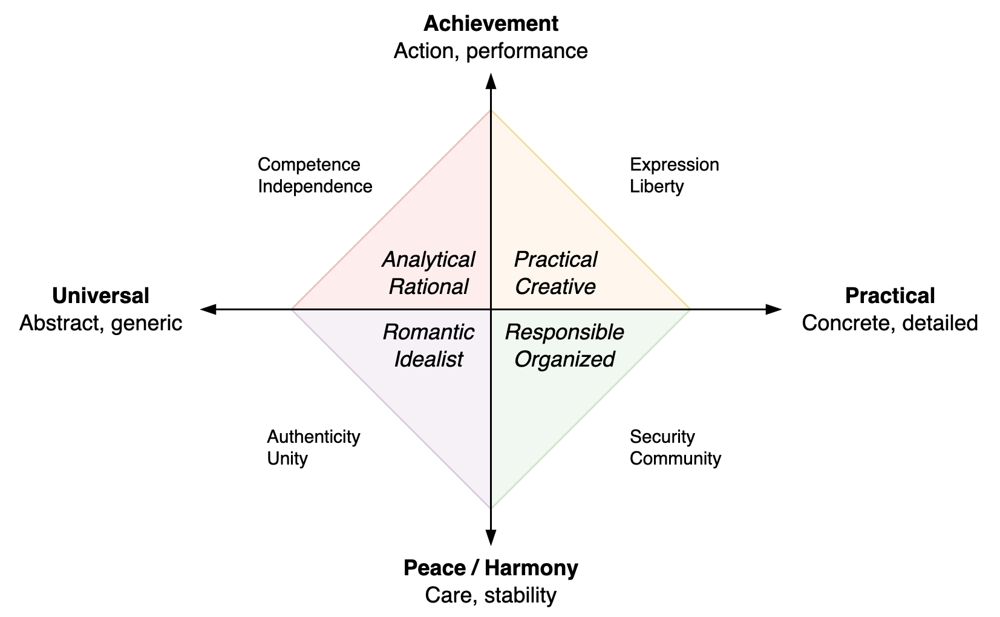
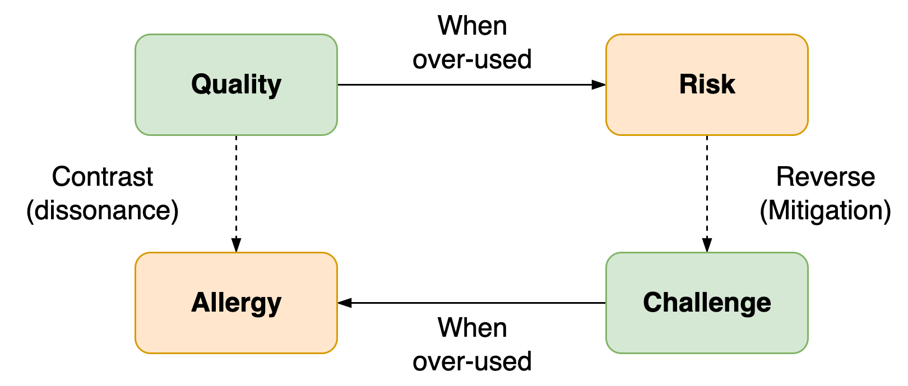

# Personality

See also [social dynamics](../collaboration/social-dynamics.md).

[toc]

## Overview

> The Self does not exist.

A personality is the collection of behavioural, cognitive and emotional patterns of a person. The Self is a multiplicity. It adapts to different environments. It consists of a range of static patterns or roles that can be triggered by associations. When learning, one develops new patterns.

- Patterns can be useful in a specific context and adverse in another.
- Suppressing (old) patterns costs energy.

### Extremes

*Temperament* is a concept that describes the level of reactivity and energy. How strong people respond to stimuli.

People may identify themselves with specific patterns, e.g. their thoughts. 

- [Dissociative identity disorder](https://en.wikipedia.org/wiki/Dissociative_identity_disorder) (DID) is characterized by an extremely high decoupling of personalities.
- [Borderline personality disorder](https://en.wikipedia.org/wiki/Borderline_personality_disorder) (BDP) is characterized by episodes of extreme feelings and instability.

## Personality Traits

Personality traits are underlying or stable patterns of ones personality. Stronger traits persist in a great range of contexts.

### Individual traits and characteristics

Discomfort

- Vulnerability. Being exposed to potential danger or harm.
- Courage. The willingness to be vulnerable, to confront agony.
- Patience.

Value

- Dignity. Self-worth, self-respect, self-care.
- Assertiveness. The expression of dignity.

Truth

- Sincerity. Acting in line with your personal values, desires and beliefs.
- Authenticity. Acting in line with your personal values and desires, despite external influence.
- Integrity. A mix of authenticity, honesty, responsibility, reliability. Whether you are yourself.

Compassion

- Sympathy. Understanding someone's experience.
- Empathy. Sharing someone's experiencing.
- Passion
- Care
- Consideration

#### Authenticity

Wild, untamed.

Effects

- Withholding leads to withdrawing and rejecting
- Revealing leads to connecting

Not authentic

- Cautious
- Careful
- Guarded
- Hestitant
- Reserved
- Restrained

#### Integrity

> Do the right thing

Integrity means:

- Feel your feelings. Express your emotions. Be authentic.
- Speak authentically and candidly. Address tension and discomfort.
- Take responsibility. Claim responsibility and agency rather than blaming and criticizing.
- Be reliable. Follow through on agreements. Communicate surprises early.

Transparent communication

  - Congruent. Message, form and intent match. This costs [less energy](https://en.wikipedia.org/wiki/Cognitive_dissonance).
  - Direct but respectful. E.g. "I do have a strong opinion on this" vs. "This is absurd!".
  - Complete. Consider your senses, feelings, thoughts. Consider what you want for yourself and for someone else.

See Jim Dethmer.

### Models

[Myers-Briggs](https://en.wikipedia.org/wiki/Myers%E2%80%93Briggs_Type_Indicator) model.

1. Extravert (outward) - Introvert (inward). Getting vs. costing energy from others.
2. Sensing (application) - Intuiting (theoretical). Preference when taking in information.
3. Thinking - Feeling. When making decisions.
4. Judging (strict rules) - Perceiving (flexible, pragmatic).

[Big Five](https://en.wikipedia.org/wiki/Big_Five_personality_traits) personality traits

- [openness to experience](https://en.wikipedia.org/wiki/Openness_to_experience) (inventive/curious vs. consistent/cautious)
- [conscientiousness](https://en.wikipedia.org/wiki/Conscientiousness) (efficient/organized vs. extravagant/careless)
- [extraversion](https://en.wikipedia.org/wiki/Extraversion_and_introversion) (outgoing/energetic vs. solitary/reserved)
- [agreeableness](https://en.wikipedia.org/wiki/Agreeableness) (friendly/compassionate vs. critical/rational)
- [neuroticism](https://en.wikipedia.org/wiki/Neuroticism) (sensitive/nervous vs. resilient/confident)

Other dimensions

- Goal-oriented, relation-oriented. Preference to solve the current problem, versus a preference to connect to others.
- Task-oriented, people-oriented, thought-oriented
- Active - reflective
- Careful - impulsive
- Authentic - flexible
- Feminine - masculine

### Introversion & Extraversion

Whether you *recharge* in isolation / intimacy or through contact with people and environments with an abundance of stimuli. This is affected by how safe or risky an environment is considered to be. E.g. is it a challenge or threat.

|                        | Introversion                  | Extraversion                          |
| ---------------------- | ----------------------------- | ------------------------------------- |
| **Social interaction** | Energy is consumed            | Energy is generated                   |
| **Energy Management**  | Recharge in isolation         | Energize in busy/crowded environments |
| **Preference**         | Less stimulating environments | Stimulating environments              |
| **Sharing**            | Evaluate thoughts             | Think out loud                        |
| **Appearance**         | Reserved                      | Energetic                             |

Not to be confused with shyness or social anxiety.

## Behaviour

Expression of personality in an environment.

### DISC Model

[DISC](https://en.wikipedia.org/wiki/DISC_assessment) model 💧🔥🌻☘️. Based on two dimensions.

- Task- or people oriented.
- Inward (considerate, thought-oriented) or outward (extravert, feeling) energy.

|                 | 💧 Cool Blue    | 🔥 Fiery Red             | 🌻 Sunshine Yellow               | ☘️ Earth Green          |
| --------------- | -------------- | ----------------------- | ------------------------------- | ---------------------- |
| **Value**       | Considerate    | Determined, dominant    | Inspiration, excitement, social | Caring, sharing        |
| **Preference**  | Analyze        | Fast action             | Together                        | Fairness, conservative |
| **Active**      | Inward         | Outward                 | Outward                         | Inward                 |
| **Orientation** | Task           | Task                    | People                          | People                 |
| **Risk**        | Cold, cautious | Aggressive, controlling | Persuasive, hasty               | Conforming, reliant    |

#### Roles

The four colors map to roles within an organization.

|                 | Examiner         | Challenger         | Charmer         | Harmonizer      |
| --------------- | ---------------- | ------------------ | --------------- | --------------- |
| **Desire**      | To understand    | Voice your opinion | Connect         | Adapt           |
| **Need**        | To be understood | Be heard           | Get along       | Peace           |
| **Orientation** | Task-oriented    | Task-oriented      | People-oriented | People-oriented |
| **Style**       | Adapt            | Give               | Give            | Adapt           |

An examiner wants to get it right. A charmer wants to get along. They may make compliments and tell jokes.

### Keirsey Quadrants

Values and purpose. See [Keirsey temperament sorter](https://en.wikipedia.org/wiki/Keirsey_Temperament_Sorter)

|                | ⚡ Artisans  | 💡 Rationals | 🌐 Idealists | 🏠 Guardians |
| -------------- | ----------- | ----------- | ----------- | ----------- |
| **Value**      | Expression  | Reason      | Unity       | Security    |
| **Preference** | Achievement | Achievement | Harmony     | Harmony     |
| **Associated** | Concrete    | Abstract    | Abstract    | Concrete    |

### Qualities & Allergies

Core quality quadrant: personal qualities & risks

> Each allergy signifies an underlying quality

For each *quality* or trait, there is an extreme which usually has adverse effects. This presents a *risk*. Often, the behaviour associated with addressing this risk is the reverse of the quality. Behaving in the opposite direction of the initial quality is *challenging*.

The extreme side of the challenge may conflict with the initial quality. This is the *allergy*.

### Roles

E.g. [Belbin roles](https://en.wikipedia.org/wiki/Team_Role_Inventories).
