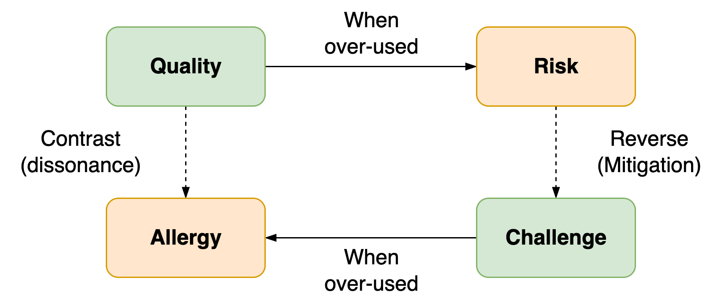

# Qualities & Allergies

Core quality quadrant: personal qualities & risks

> Each allergy signifies an underlying quality

For each *quality* or trait, there is an extreme which usually has adverse effects. This presents a *risk*. Often, the behaviour associated with addressing this risk is the reverse of the quality. Behaving in the opposite direction of the initial quality is *challenging*.

The extreme side of the challenge may conflict with the initial quality. This is the *allergy*.

Critique

1. The model is biassed toward moderate qualities. It implies that conflict is resolved through personal growth. Neurodivergent people should un-learn any traits that are  extreme.
2. Many traits are situational. The environment determines whether a trait is a handicap or not.

