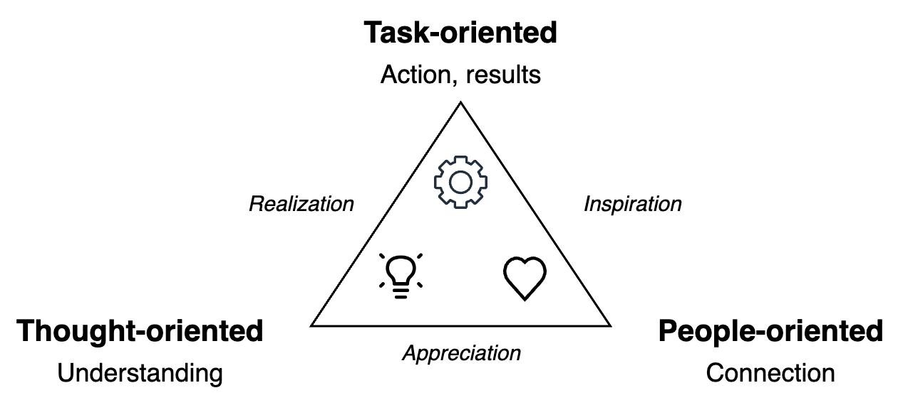

# Relations

The nature of personal relations can vary.

- Transactional. Fair exchange of services. Interface-based. Mutual benefit.
- Reciprocal. Personal. Based on cooperation. Mutual support. Shared experience. Long-term
- Shared interests.

|                  | Transactional   | Reciprocal        | Shared Interests |
| ---------------- | --------------- | ----------------- | ---------------- |
| **Core**         | Fair exchange   | Shared experience | Aligned actions  |
| **Purpose**      | Mutual benefit  | Mutual support    | Shared vision    |
| **Meta-purpose** | Result-oriented | People-oriented   | Thought-oriented |
| **Method**       | Trade           | Cooperate         | Alignment        |
| **Time-horizon** | Instantaneously | Long-term         | Long-term        |

### Related Models

