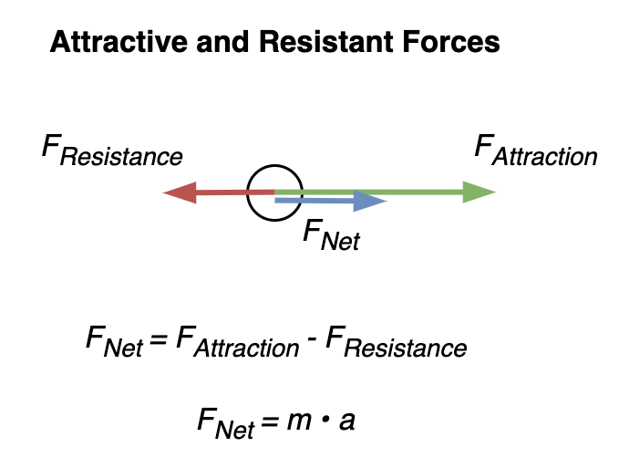

# Forces

[TOC]

## Overview

Reality is hold together by forces. A force is caused by an attraction of two objects. This attraction is based on *quality*: physical or social properties. See also [mathematical force](../math/force.md).

## Theoretical Forces

In general, change is a result of the sum of *attractive* and *resistant* forces. I.e. change is driven by convenience. See [least effort](https://en.wikipedia.org/wiki/Principle_of_least_effort) and [least resistance](https://en.wikipedia.org/wiki/Path_of_least_resistance). 

### Relativity

Suppose reality is described by a set of *things*: objects, subjects and organizations.

- A *thing* has static (objective) qualities. Things are attracted to each other in varying amounts.
- A subject is a *thing* that is attracted to an *impression* of another *thing*. The strength of this attractive force is the subjective *value* of the other.
- This *impression* is a filter through which the other is observed. It may be dependent on e.g. distance.
- A force causes a thing to change (e.g. its position). Forces sum linearly. Two opposing forces may cancel out.

### Composite Structures

Compositions of forces create structures.

- Rigid structures are held together by bonds. These may be rigid or flexible.

- Orbit-based structures are centered around a **star**. E.g. a body that is heavy or famous.

## Real Forces

We can distinguish four types of forces. These may supersede each other. E.g. the wings of a bird outmatch gravity.

|                         | Keywords                    | Quality      |
| ----------------------- | --------------------------- | ------------ |
| **Inorganic** forces    | Physical forces             | Mass, energy |
| **Biological** forces   | Affinity, sexual attraction | Pleasure     |
| **Social** forces       | Community                   | Community    |
| **Intellectual** forces | Shared understanding        | Knowledge    |

### Physical forces

Based on objective properties of objects.

- Four fundamental forces
    - [Strong](https://en.wikipedia.org/wiki/Strong_interaction) and [weak](https://en.wikipedia.org/wiki/Weak_interaction) nuclear forces
    - [Gravitation](https://en.wikipedia.org/wiki/Gravity)
    - [Electromagnetism](https://en.wikipedia.org/wiki/Electromagnetism)

- Emergent/composite forces
    - [Chemical bonds](https://en.wikipedia.org/wiki/Chemical_bond), [metallic bonds](https://en.wikipedia.org/wiki/Metallic_bonding)
    - [Orbital mechanics](https://en.wikipedia.org/wiki/Orbital_mechanics)

### Biological forces

Based on preferences of subjects.

- Affinity (likes and dislikes)
- Sexual attraction

### Social forces

Based on social and economic qualities.

- Fame
- Honour
- Profit
- Morality

### Intellectual forces

Based on knowledge.

- Contagious strength of ideas

