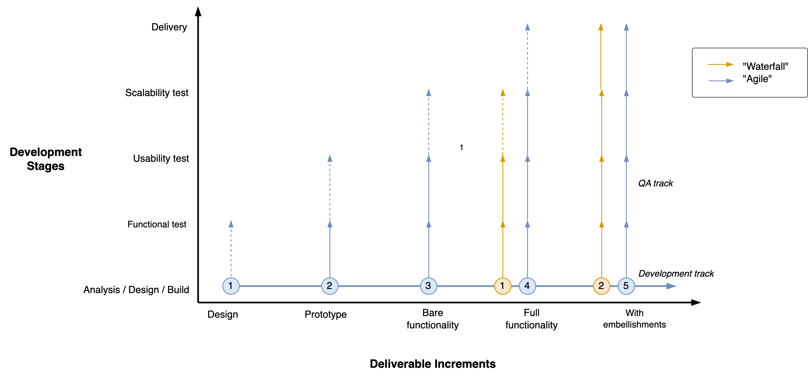

# Agile

Agile software development is a set of practices that optimize for complex environments. Agility helps to deliver value sooner, safer and happier.

[toc]

## Overview

Agile values, based on the [Agile manifesto](https://agilemanifesto.org/). The right-hand side is associated with project management in the 90s.

|      | Agile                        | Non-Agile                   |
| ---- | ---------------------------- | --------------------------- |
| 1.   | Individuals and interactions | Processes and tools         |
| 2.   | Working software             | Comprehensive documentation |
| 3.   | Customer collaboration       | Contract negotiation        |
| 4.   | Responding to change         | Following a plan            |

In addition, it appreciates [empiricism](../intelligence/empiricism.md).

These affect products, people and processes.

In practice, this requires:

- Self-organizing and cross-functional teams.
- Awareness of the value chain and the freedom to improve it.
- Short feedback loops. E.g. continuous integration.

|                       | Agile                   | Non-Agile                    |
| --------------------- | ----------------------- | ---------------------------- |
| **Focus**             | Value & user experience | Cost & profit                |
| **Structure**         | Self-organizing teams   | Isolated teams (silos)       |
| **User requirements** | To be discovered        | Fixed, determined in advance |

### Example

Given an environment with complex problems and ambiguous, uncertain or unstable requirements, there are several approaches one can take:

- Start with better planning. Documenting as much as you can.
- Start building the most likely solution and commit to finishing it.
- Start by solving a small part of the problem. Afterwards reconsider what to next.
- Start with prototypes to validate assumptions (validated learning). Work iteratively towards more realistic designs.

The last two are agile approaches.

### Benefits

*Why should capitalists care?*

Agile attempts to:

- Increase long term revenue by delivering more value.
- Deliver value sooner, which means that the revenue stream starts sooner.
- Be resilient to uncertainty and risks through agility.

*Why should developers care?*

Agile is associated with:

- A happier and more relaxed work environment.
- More agency and involvement in decision making.
- Less meetings and deadlines

## Delivery

See [delivery](../legacy/realization.md).

### Agile and Waterfall Projects

Watefall-type projects start with full requirements. Development and testing happens afterwards, in sequence. Agile approaches start earlier with (functional) testing and then improve the design in increments.

|                     | Waterfall                 | Agile                   |
| ------------------- | ------------------------- | ----------------------- |
| **Optimize for**    | Throughput (output)       | Market fit (outcome)    |
| **Scope**           | Requirements drive design | Discovery drives design |
| **Decision making** | Theoretical (top-down)    | Empirical               |
| **Testing**         | Eventually                | Continuously            |
| **Worst case**      | Project fails             | Project is insufficient |

This graph shows the granularity of increment verses the development stages. The steepness of the line is associated with risk apetite.

For software projects the increments follow a typical form.

