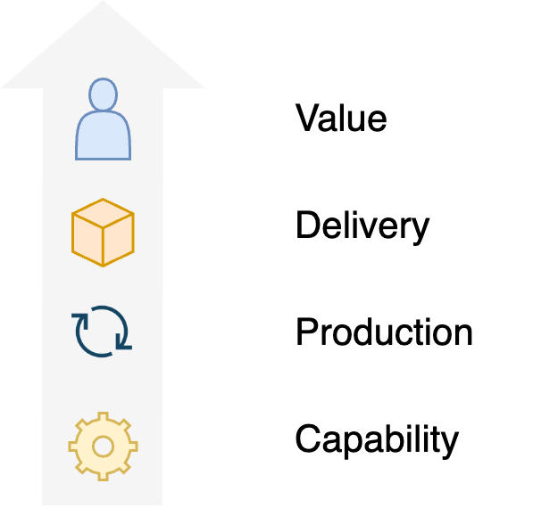

# Engineering

See also the guides [testing](../guides/test-more-effectively.md) and [optimization](../guides/optimize-processes.md).

[toc]

## Overview

Engineering focusses on producing high quality results.

This requires:

- Collaboration and strategy. Managing long term objectives and short term activity. See [performance](../collaboration/teams.md).
- Validated learning. See [discovery](../labour/discovery.md) and [learning](../intelligence/learning.md).
- Delivery. Finishing assignments/exercises/projects. See [realization](../labour/realization.md).
- Management of capabilities. See [systems engineering](systems-engineering.md).

It aims to do so reliably and predictably.

Engineering is surrounded by product management. It's boundaries are busines administration, sales, etc.

## Collaboration

Significant work is done in collaboration. Organizations are usually divided in departments and teams. This structure is directly [related](https://en.wikipedia.org/wiki/Conway%27s_law) to production. 

It entails

- Communication
- Leadership

### Performance

It involves

- Team success
- Team performance.

|                     | Success                      | Performance    |
| ------------------- | ---------------------------- | -------------- |
| **Functional view** | Team vision                  | Value delivery |
| **Social view**     | Team dynamics                | Production     |
| **Biological view** | Trust (appreciation, safety) | Team health    |

  

