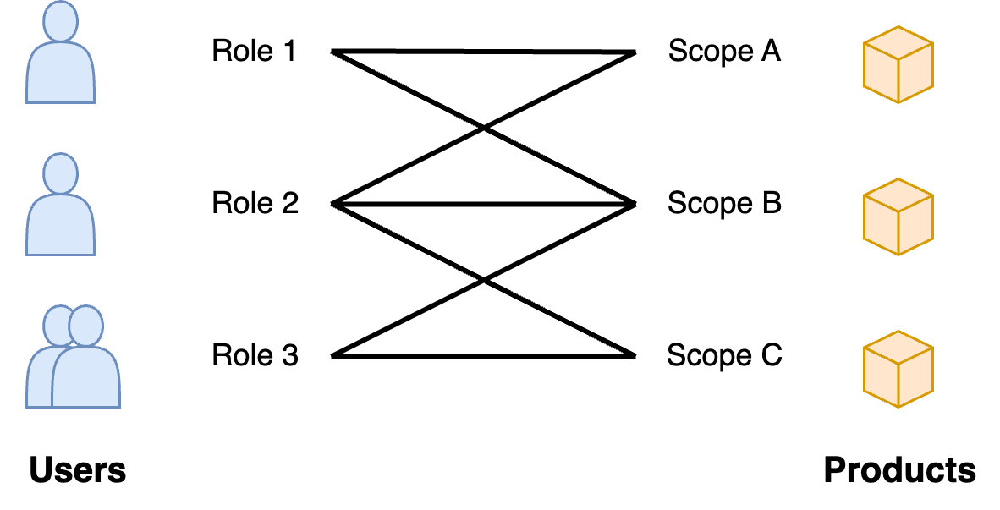

# Security

[toc]

## Overview

Flow

1. [Identification](https://en.wikipedia.org/wiki/Identity_(philosophy)). Comparing the identity of a requestor.
2. [Authentication](https://en.wikipedia.org/wiki/Authentication). Verifying the identity of a requestor.
3. [Authorization](https://en.wikipedia.org/wiki/Authentication).  Specifying access rights/privileges to resources.

E.g.

1. Identity: `Alice`
2. Authentication: a passport with her picture.
3. Authorization: `Alice` has access to specific bank accounts.

**Authentication (AuthN)**

[Verification](https://en.wikipedia.org/wiki/Authentication) of an [identity](https://en.wikipedia.org/wiki/Identity_(philosophy)). This can be done based on property that is unique to an identity. E.g. something that is known, in possession, a location or a real property such as a fingerprint. Combining multiple types of properties strengthens the verification through diversification.

- Shared secrets. A token or password known only to the client and the server. A client presents this secret to a server. The server verifies it.
  - The secret does not have to be send directly. Alternatives include:
    - A *hash* of the secret.
    - Proof by solving a numerical puzzle, using the secret.
  - The client secrets may be unique for each server, or shared between servers.
  - Security can be strengthened through introducing MFA (see below).
- Proof of access to a private external resource. E.g. an email account, a network, a key or card.
- A an assertion that is provided by a trusted server: an *identity provider* ([IDP](https://en.wikipedia.org/wiki/Identity_provider)).
  - [Certificates](https://en.wikipedia.org/wiki/Public_key_certificate) that are signed by a [certificate authority (CA)](https://en.wikipedia.org/wiki/Certificate_authority).
  - Short-lived ID tokens. E.g. [JWT](https://en.wikipedia.org/wiki/JSON_Web_Token).

**Authorization (AuthZ)**

[Specifying](https://en.wikipedia.org/wiki/Authorization) access rights or privileges to resources. I.e. granting access to resources. Variants include:

- Unrestricted access. E.g. for unidentified (anonymous) users.
- A static mapping of identities to resources. E.g. a whitelist.
- Outsource authorization to an [IDP](https://en.wikipedia.org/wiki/Identity_provider).
  - E.g rely on short-lived access tokens.
  - E.g. [Oauth](https://en.wikipedia.org/wiki/OAuth), where access is delegated from a user to a client application - without actually sharing the user's private credentials.
- Use a public channel to send a notification (an event). Then let the server initiate a response.

**Single Sign-On (SSO)**
An authentication scheme that allows a user to log in with a single ID to different independent systems. [Example](https://learn.microsoft.com/en-us/azure/active-directory/manage-apps/what-is-single-sign-on).

**Multi-factor Authentication (MFA)**
Combining multiple authentication methods.

**Conditional access**
Grant access requests [based on](https://learn.microsoft.com/en-us/azure/architecture/framework/security/design-identity-authentication) the requestors' trust level and the target resources' sensitivity.

**DDoS**

Distributed denial of service.

**Roles and scopes**




## Encryption

### Symmetric cryptography

Use a *shared* key to encrypt and decrypt messages. This key is known only to the sender and the receiver.

```python
# simple symmetric encoding
msg = 1010
key = 1111

def encode(msg, key):
    # Encode `msg` using binary addition
    return msg + key

def decode(msg, key):
    return msg - key

# a sender can encode a msg using the shared key
encoded_msg = encode(msg, key) # 0101 (in binary)

# a receiver can decode the msg using the shared key
decoded_msg = decode(encoded_msg, key) # 1010
```


### Asymmetric cryptography

Use a *public* and a *private key*. The public key is derived from the private key, based on a chosen algorithm. Ideally this algorithm is expensive to reverse engineer.

The message receiver shares the public key with the sender. The sender then uses this key to encrypt their message. The receiver can decrypt this message using their private key.


## Typical Vulnerabilities

See [OWASP](https://owasp.org/API-Security/editions/2023/en/0x11-t10/).

- Authentication. E.g. steal someones credentials.
- Authorization. Broken object-level authorization (BOLA), mass assignment.
- API design . Excessive data exposure. E.g. client-side authorization, client-side filtering.
- Rate limiting. E.g. DoS through a modified payload. E.g. when there's no limits for *paging*.
  - The range of input parameters may be ill-defined.
- Injection.
- Asset / inventory mangement.


