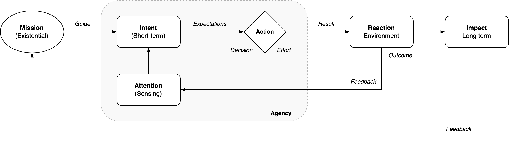
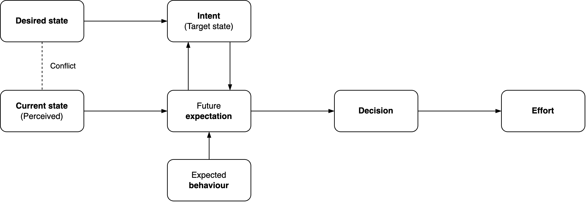
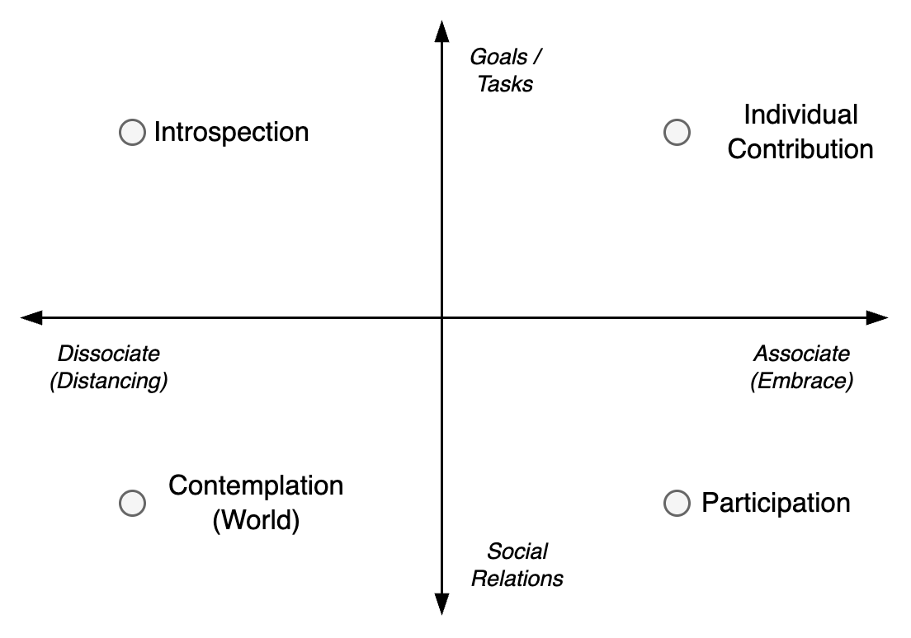

# Change

Change is a **deviation** of a standard trajectory. It is inherently dynamic. It can be gradual or disruptive.

[toc]

## Context

The main types of activity are: continuation, deviation and rejection. See [activity](activity.md).

**Continuation** relates to business as usual (BAU): daily operations. Repetition. An organization will keep operating indefinitely until something changes. Similar to the conservation of [momentum](https://en.wikipedia.org/wiki/Momentum). This may include continuous improvement.

**Deviation** involves a *change* to the standard trajectory. E.g. improvement projects.

**Rejection** involves reflection. It reconsiders the self or its environment. It creates space for attention and reflection.

|                  | Continuation      | Deviation        | Rejection           |
| ---------------- | ----------------- | ---------------- | ------------------- |
| **Purpose**      | Self-preservation | Self-expansion   | Self-reflection     |
| **Method**       | Operations (BAU)  | Change direction | Question status quo |
| **Acceleration** | Speed up          | Adjust course    | Slow down           |

### Gradual and disruptive change

|            | Gradual                    | Disruptive            |
| ---------- | -------------------------- | --------------------- |
| **Core**   | Continuation (progression) | Deviation (rejection) |
| **Style**  | Natural                    | Cultivated, enforced  |
| **Origin** | Evolved, emerged           | Created, manufactured |

### Effort

Change requires effort

- Accept risk. Accept discomfort.
- Overcome inertia.
- Move towards something.

## Drive

Change is determined by:

1. A static idealistic goal. A mission or vision. The existential purpose of the subject. This depends on its [identity](../activity/identity.md).
2. A dynamic part. The interaction of the agent with the environment.
   1. The agent may observe the environment.
   2. The agent may act on the environment.

An agent controls its actions. The *outcome* is defined as the result of the agent's effort. By definition, it is out of the agent's control.

The desires (purpose) of an agent can be separated into its existential purpose (mission) and it desire.

> No action = an action

Change is affected by the expected feasiblity of effort.

Change can be welcomed or rejected. The intent and effects can be immediate or long-term.

## Attention

Dimensions

- **Focus** on self or others. Focus on relations or goals/tasks.
- **Immersion**. From dissociated to associated. From distancing to embracing life.
- **Time-horizon**. Past, present or future.

## Intent

**Types of desire.**

1. Hedonistic desire. Improve a [feeling](../psychology/emotions.md) (personally) or attract value (professionally).
2. Motivational desire. Reach a specific goal. E.g. in order to improve a feeling.
   1. Move towards a specific *thing* that is attractive.
   2. Repulse some*thing* that is unattractive.
3. Positioning. Move towards a position of opportunity. E.g. in order to improve a feeling.

**Types of needs**

Standard human needs (Maslow).

1. Survival. Physiological needs.
2. Safety. Security.
3. Acceptance, belonging, friendship, intimacy.
4. Recognition. Prestige.
5. Knowledge and understanding
6. Order and beauty
7. Self-actualization. Realizing ones potential.

### Intent of actions

- **Unintended** behaviour. Behaviour is initiated by an external (attractive) force. The subject is passive.
- **Intended** behaviour. Behaviour is initiated by the subject.
    - **Reactive** behaviour.
        - Immersive behaviour. The intent is to decrease difference between the other. The other is perceived to have high quality.
        - Distancing behaviour. The intent is to increase difference with the other. The other is perceived to have low quality.
    - **Anticipating** behaviour. The intent is based on higher-order effects, rather than direct effects.
        - Pro-active behaviour. The intent is decoupled from a stimulus. The intent is to position one to areas with high quality. 
        - Avoiding behaviour. The intent is increase distance to a specific area with low quality. It is not based on a specific forward direction.

See also [risk management](../management/risk-management.md).

## Unintented Behaviour

Unawareness of influences can lead to sub-optimal behaviour. A typical form of this are fears that are not acknowledged.

**Fears**

Fears that are not understood or acknowledged may result in ineffective behaviour.

An example at organization level.

- An organization *needs* to provide value to shareholders.
- It *values* a competitive advantage, to ensure profitability.
- It *desires* high efficiency as the main method to outperform competitors.
- It *fears* inefficiency waste and under-utilization of resources.
- The resulting *behaviour* could be to:
  - Maximize resource utilization, which could result in over-production.
  - Control employee performance, which could limit autonomy and may impact motivation.

## References

- Byung-Chul Han. *The Scent of Time: A Philosophical Essay on the Art of Lingering*

