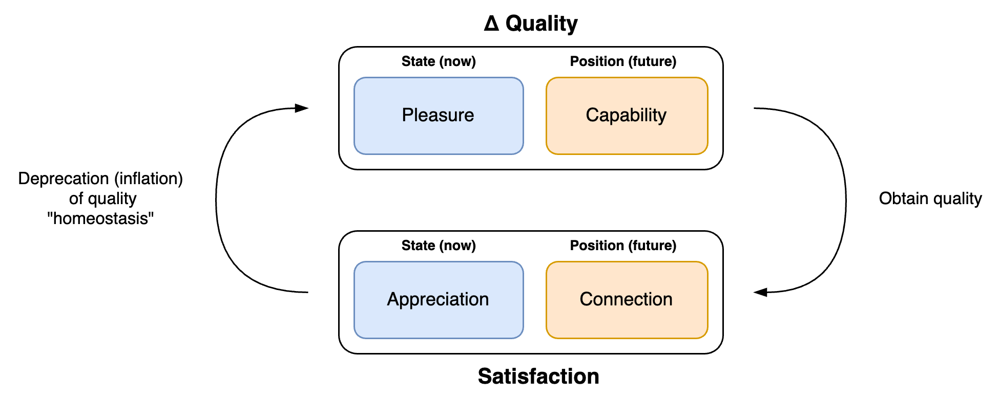

# Desire

Subjects or agents have desire. Their identity determines their dreams (inherent desire) and there intent (day-to-day desires). Together with expectations and habits this determines their behaviour.

## Multiplicity

A single model won't capture the complex landscape of desires of humans. Imagine sea waves, where there is a stable under-current, and dynamic surface-currents. There is never a single static desire.

## Simple Model

Desire consists of two parts:

- Δ Quality. Difference in the quality of your experience.
- Satisfaction. Being satisfie. Positioning that has a high likelihood of satisfaction.

Note that the expecation of improvement can be more pleasurable than obtaining the actual improvement.

|                          | Δ Quality           | Satisfaction            |
| ------------------------ | ------------------- | ----------------------- |
| **State** (present)      | Pleasure, comfort   | Appreciation (attitude) |
| **Position** (potential) | Improved Capability | Connection, harmony     |

 This model shows an inherent conflict.

- Independence. I.e. agency, autonomy. Have the capability to obtain pleasure.
- Dependence. Connection. Be part of something great.

### Satisfaction

How satisfied you are or feel. Note that this does not equate to happiness.

**State**. How satisfied you are in the present moment. Based on your present state and attitude.

- Appreciation of the past, present and future.

**Position**. The likelihood of feeling satisfied based on environmental factors.

- Connection. Relation to systems that give stability or pleasure. Be part of something great.
- Harmony. The opposite of being in conflict with your environment or with yourself. Being free to express yourself.

### Δ Quality

Difference in quality. More pleasure, less pain. Now as well as in the future.

**State**. How you feel in the present moment.

- 📈 More pleasure.
  - Euphoria, bliss. Hormones that give pleasant feelings.
  - Excitement. Energy. Arousal. Surprise.

- 📉 Less pain. Avoiding unpleasant feelings. Avoiding discomfort, frustration.
  - Dissociate or mitigate. E.g. not paying attention.

**Position**. Expectations on how you will feel in the future.

- Capability, power, status, freedom.

 

### Attention

Attention relates to both state and position. It can give direct pleasure or signal pleasure. Rejection and neglect have the opposite effect. In this model, attention encompasses appreciation and validation. I.e. be liked, valued and understood.

Strategies to get attention:

| Goal-oriented                      | Relation-oriented                                        | Context                     |
| ---------------------------------- | -------------------------------------------------------- | --------------------------- |
| Impress others. Get power, status. | Connect to others. Develop inimate and stable relations. | Find the right environment. |

