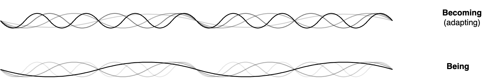
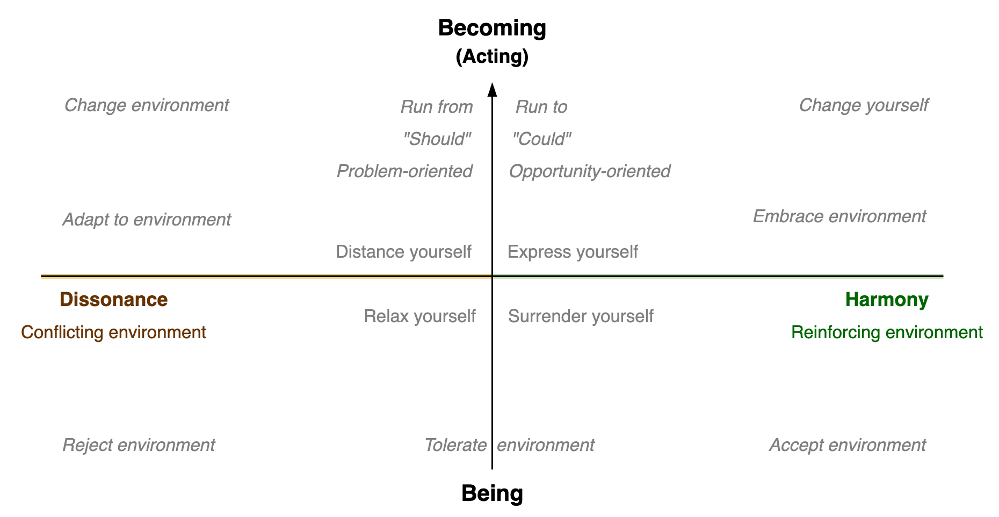
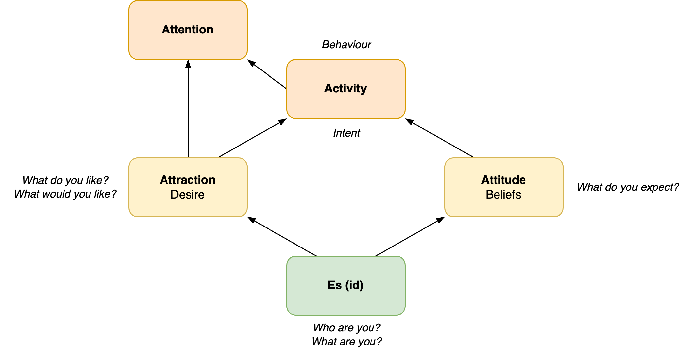
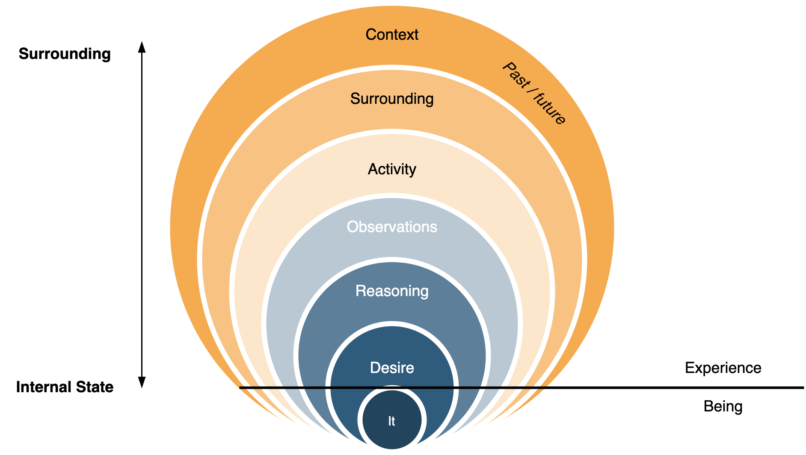
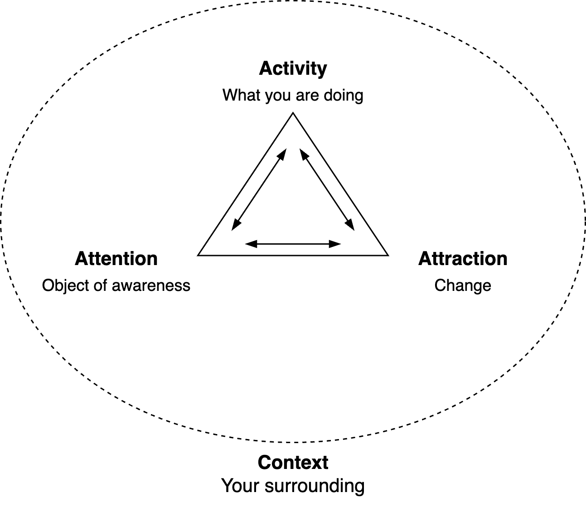
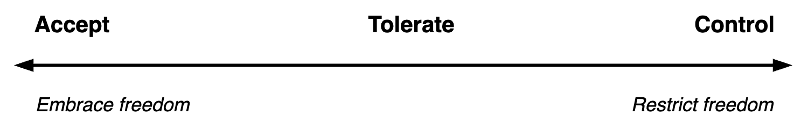
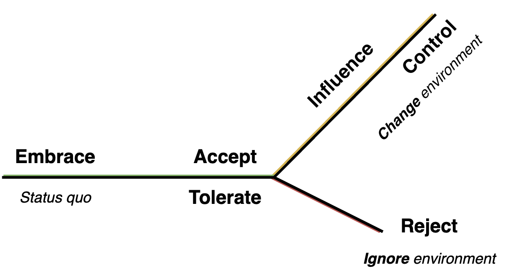

# Experience

Subjects and agents have experience: *What it is like to be you.*

In philosophy, there is a distinction between a (human) subject and a zombie. The latter does not experience anything.

[toc]

## Overview

Experience is fundamentally dynamic. It's a verb: to experience. A first characteristic is the rate of change: being or becoming. This relates to the environment.

- Being involves self-expression and authenticity. Despite the environment.
- Becoming involves adaptation, influence and control. Atuned to an (new) environment.

These concepts relate to change management and mindfulness.

## Hierarchy

Behaviour and context:

- Context. The surroundings of the subject. *Where are you?*
- Its activity. *What are you doing?*

Interal experience:

- Its attention. Thinking, feeling or observing (awareness of something). 
- The object of attention. E.g. another subject. *Where is your attention? What's on your mind? What do you feel?*
- Its desire. *What would you like? What is attracting you?*

Type of subjects

- For people, experience consists of feelings and thoughts. Atrraction is guided by desire.

- For robots, experience consists of activity, attention and attraction.

Layers

- Behaviour (external)
- Thoughts and feelings (internal)
- Underlying being (implicit)

## Attitude

The experience of an agent can be positive or negative. The agent may judge observations.

A neutral attitude is to tolerate the enviornment.

