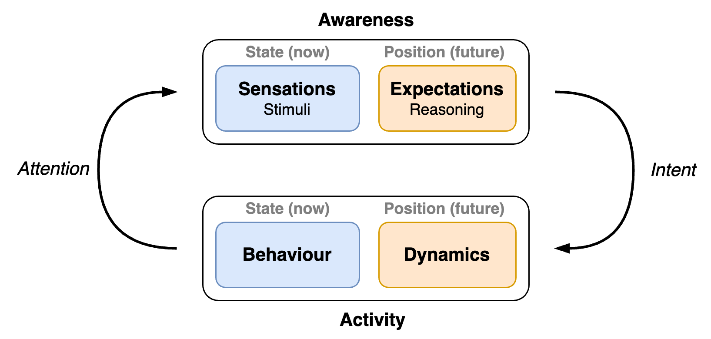
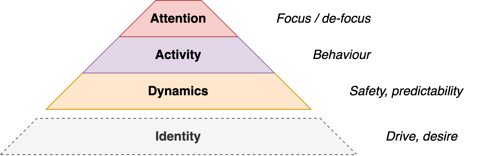
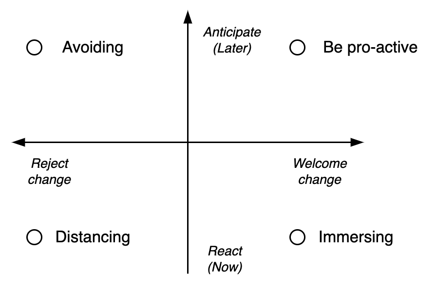

# Experience

Subjects and agents have experience: *What it is like to be you.*

- In philosophy, there is a distinction between a (human) subject and a zombie. The latter does not experience anything.

[toc]

## Overview

Experience of an agent consists of [attention](attention.md) and activity (behaviour). It is influenced by the dynamics of the environment.

There is a strong interplay between awareness (attention) and activity (behaviour).

- Human agents have feelings and desires.
- Other agents have goals and intent.

Experience exists in a context. [Identity](identity.md) drives [desire](desire.md).

## Activity

Experience is fundamentally dynamic. It's a verb: to experience. A first characteristic is the rate of change: being or becoming. This relates to the environment.

- Being involves self-expression and authenticity. Despite the environment.
- Becoming involves adaptation, influence and control. Atuned to an (new) environment.

These concepts relate to change management and mindfulness. Acting can be done based on problems or opportunities. An agent can adapt itself or the environment. See [human experience](../psychology/experience.md).

Change can be welcomed or rejected. The intent and effects can be immediate or long-term. See [change](change.md).

## Hierarchy

Behaviour and context:

- Context. The surroundings of the subject. *Where are you?*
- Its activity. *What are you doing?*

Interal experience:

- Its attention. Thinking, feeling or observing (awareness of something). 
- The object of attention. E.g. another subject. *Where is your attention? What's on your mind? What do you feel?*
- Its desire. *What would you like? What is attracting you?*

Type of subjects

- For people, experience consists of feelings and thoughts. Atrraction is guided by desire.

- For robots, experience consists of activity, attention and attraction.

Layers

- Behaviour (external)
- Thoughts and feelings (internal)
- Underlying being (implicit)

## Attitude

The experience of an agent can be positive or negative. The agent may judge observations.

A neutral attitude is to tolerate the environment.

