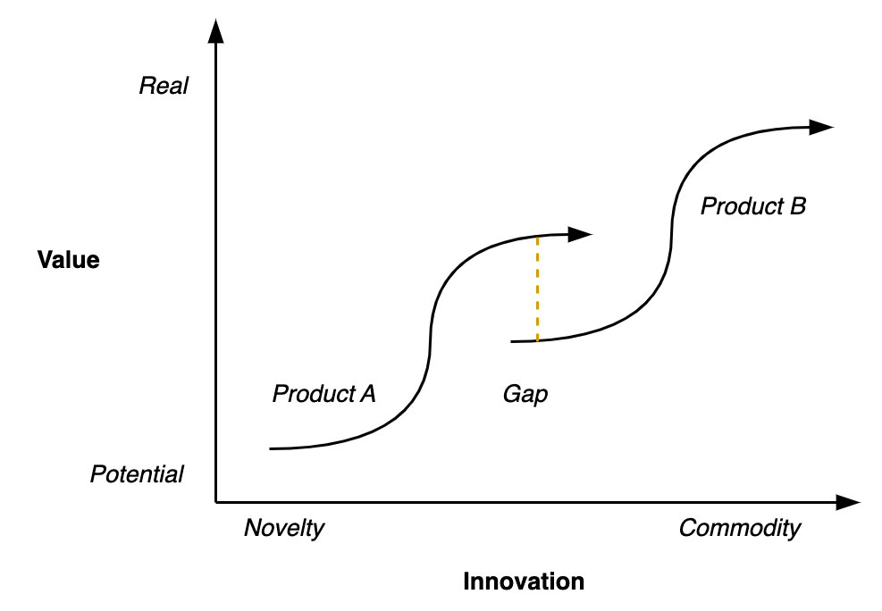

# Progression

Reality tends to change over time. This is either a *progression* towards [quality](../metaphysics/quality.md) or [comfort](comfort.md), or a *regression* away from it. See [domains](../reality/domains.md), [forces](../reality/forces.md) and [structures](../reality/structures.md).

## Overview

Progression may result in *optimization* or *expansion*.

- Optimization happens in sequence (on top) of the current structure. The result is contingent upon the old structure.
- Expansion happens in parallel (in addition) to the current structure. The result may replace the old structure.

Progression requires a cycle of *innovation* and *preservation*.

- Too much preservation leads to stagnation.
- Too much disruption leads to degeneration (degradation).

Innovation is a disruption that ends with preservation. The disruption needs to be latched onto something static.

1. Innovation starts with a disruption, an action (a thesis).
2. This action creates a reaction (anti-thesis). It disrupts the status quo. The reaction is proportional to the action.
3. The change in reality needs to be resolved into a new structure that can be preserved (synthesis). The disruption needs to be latched onto a static reality.

Structures may emerge as a result of these dynamics.

- Static patterns provide a safety net. They facilitate experimentation.

**Revolution vs. Evolution**

Changes van vary from being large and disruptive, to gradual shifts.

## Thesis-antithesis-synthesis

A three-steps pattern. In general, small (fast) cycles are less disruptive.

1. **Thesis**. An idea (eureka) or a revolution. Associated with hype and momentum.
2. **Antithesis**. A conflict. The new way will naturally differ from the old paradigm and will have to be tested to real-word scenario's. There can be resistance from the status quo. Moreover, the existing structures are optimized for the old paradigm. Output is likely to decrease for a while. Change is an investment that might pay off over time.
3. **Synthesis**. A resolution where the new way is incorporated and becomes part of the main paradigm. Side-effect of the original change are resolved.

## Innovator's dilemma

New innovations need room to realize their potential value.

- Often, the return on investment of an innovation has a [sigmoid](https://en.wikipedia.org/wiki/Sigmoid_function)-like shape. Initially the returns grow steeper, but eventually they will stagnate.

