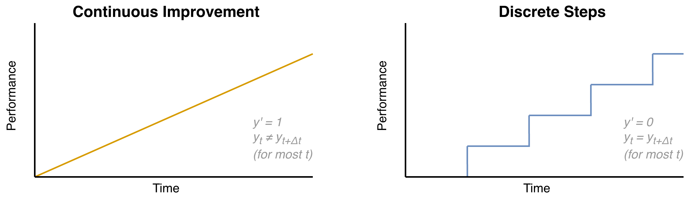

# Continuous & Discrete Improvement

Complex systems can be improvement experimentally. Perturbations can be done randomly or based on hypotheses. See also [empiricism](../intelligence/empiricism.md) and [scientific theory](../intelligence/scientific theory.md).

1. Evaluate the performance of the system. *Create an hypothesis.*
2. Perturb the system. *Study the effects of the perturbation.*
3. Evaluate the performance over a given period and repeat. *Update your hypothesis.*

Examples would be be

- Progressive overload in strength training.
- Changing the size or scope of a team.

## Stepsize

**Continuous improvement** uses a minimal stepsize. For example, changing a parameter by 1% each day with the intent of increasing performance significantly over the long term. This works especially well for local optimizations with little side effects. Risks:

- In complex world systems the result will rarely be consistent.
- Because the system is always updated, it is never truly stable. 

**Discrete improvement** focus on consistency and resilience. The recovery time between perturbations allows the system to stabilize and side-effects to become visible. The recovery time is typically proportional to the intensity of the perturbations. Rather than being pushed continuously, the system will effectively converging to a stable state most of the time.

 