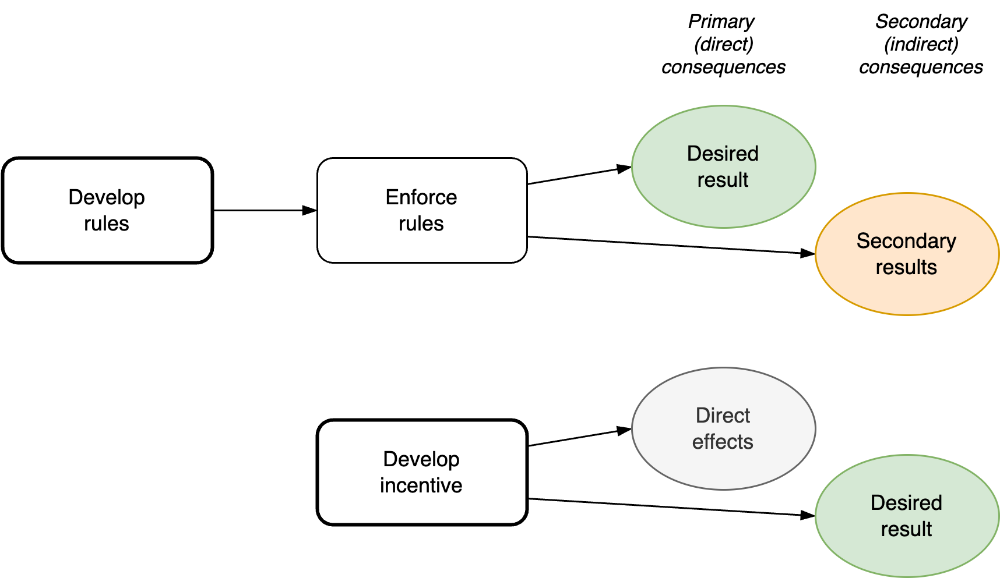

# Control & Guidance

Control implies structure. It attempts to avoid disorder and uncertainty. An alternative to control are incentives. These stimulate "right" behaviour.

[toc]

## Dual model

Similar to [light](https://en.wikipedia.org/wiki/Wave%E2%80%93particle_duality), there are two distinct views to control systems or subjects.

|                 | Control           | Guidance              |
| --------------- | ----------------- | --------------------- |
| **Core**        | Objectives        | Positioning           |
| **Consistency** | Rules, procedures | Habits, practice.     |
| **Method**      | Targets           | Vision. A north star. |
| **Optimize**    | Results           | Likelihood            |

Rules have (un)expected side effects. Incentives are designed for side-effects. This is similar to positional chess strategies, where you think 3 steps ahead. Incentives focus on improving the likelihood of desired behaviour.

Incentives rely on attitude (intent). *Make it easy to do X.*

Policies are enforced. *Make it mandatory to do X.*

### Particle view

Control specific objects. Move them exactly where you want them to be.

- Use rules and laws to improve stabilty.

- Choose initiatives that have the best return on investment.

### Waves view

See [waves](../math/waves.md). This view revolves around positioning & guidance. The world of probability. Increase the likelihood of desirable events.

- Make it easy to do the right thing. Rely on practice for consistency.

- Bet on initiatives that are likely to improve your position.