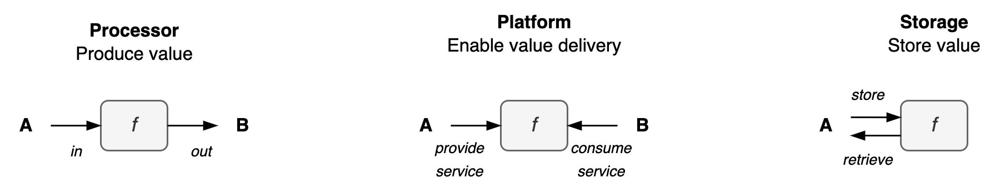
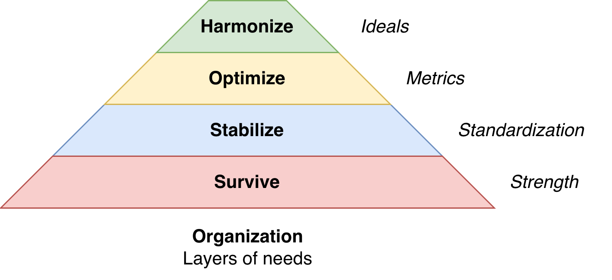

# Purpose, Desire and Needs

The purpose of the system can be expressed as its function or its needs.

## Purpose

The "final" purpose of the system trancends its function.

## Function

A single core purpose. Either:

- **Processor**. Process (produce) information or materials and *transform* them. E.g. components in a value chain.
- **Storage**. Store valuable objects and retrieve them at a later point in *time*.
- **Platform**. *Facilitate* service providers and consumers. See [platform management](../organization/platform.md).

 

## Needs

These phases can be mapped to a [hierarchy of needs](https://en.wikipedia.org/wiki/Maslow%27s_hierarchy_of_needs).

Progress toward higher layers is done through gaining power, creating structure, optimization, and creating values. Note that progression towards spirituality or impulsion is not inherently good. It is useful in a specific environment and it has side-effects.

