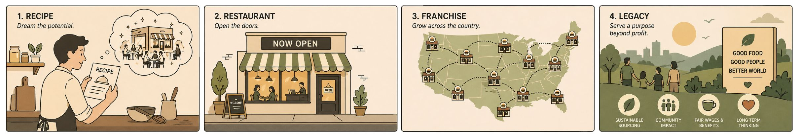
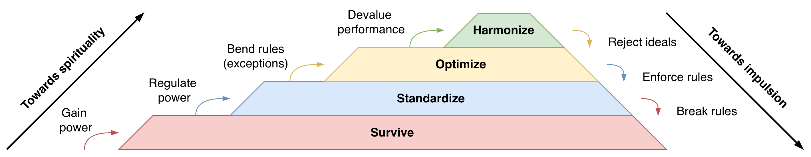
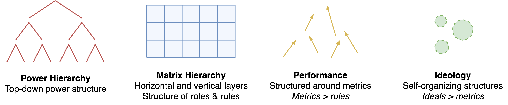
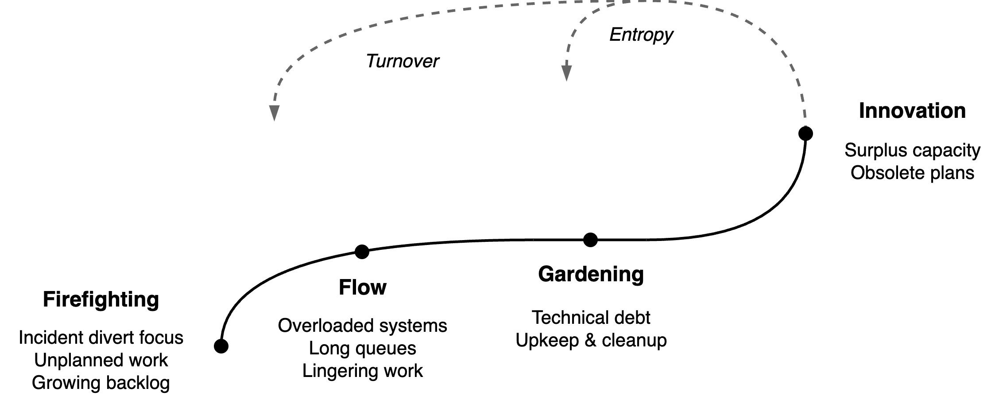

# Evolution of Organizations

Organizations are always evolving. They improve and decline as a result of internal and external pressure. See also [product lifecycle](../labour/lifecycle.md).

A capitalist example would be the transition from a small restaurant to a global franchise to a generic brand that embodies values.

## Four Stages

Organizations evolve along with their needs. Progress toward higher layers is done through gaining power, creating structure (rules), optimization (metrics) and creating values. These phases can be mapped to a [hierarchy of needs](https://en.wikipedia.org/wiki/Maslow%27s_hierarchy_of_needs). There is a resemblance to [individual desires](../psychology/desires.md).

Note that progression towards spirituality or impulsion is not inherently good. It is useful in a specific environment and it has side-effects.

## Organziational Structure

The four phases map to organizational structure.

## Team Evolution

See team [productivity](../teams/productivity-constraints.md).

