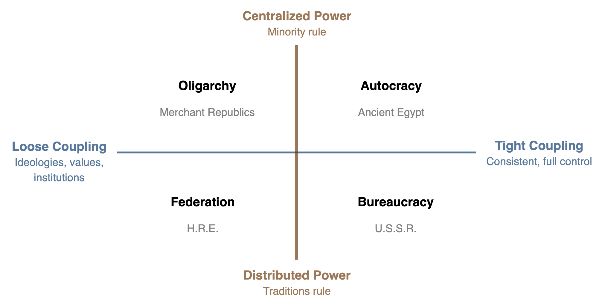
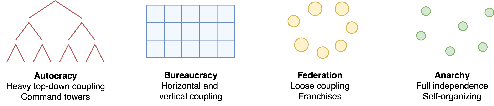
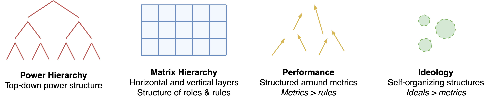

# Government

Governing and execution of power in organizations. See also:

- [coupling.md](alignment/coupling.md)
- [control-guidance.md](alignment/control-guidance.md)
- [power-structures.md](power-structures.md)

## Introduction

> Power does not exist.

Power is to a large extend invisible. It is the sum of its participants. Consider:

- 👑 The crown. A warrior-king. Power given by strength.
- 🙏 The church. A priest. Power given by social influence (faith).
- 💰 Trade networks. A merchant. Power given through leverage (resources).

## Coupling

Governments can be separated along the dimensions centralization and alignment. Centralization is "vertical" coupling an alignment is "horizontal" coupling. This approach produces four quadrants. See [coupling](../alignment/coupling.md).

- Vertical coupling: centralization of power. Top-down influence. Issuing directives.
- Horizontal coupling: consistency of components. The extend to which sub-government bodies adhere to each other. I.e. governments of regions, provinces, cities etc.

|                       | Tight Coupling                                               | Loose Coupling                                               |
| --------------------- | ------------------------------------------------------------ | ------------------------------------------------------------ |
| **Centralized** Power | **Federation**. Independent kingdoms, connected by shared values, ideologies and institutions. | **Oligarchy**. A ruling elite, but with limited power.       |
| **Distributed** Power | Totalitarian **bureaucracy**. Distributed power structures. Rules & regulation. Matrix structures. | **Autocracy**. Full centralized, top-down control. One leader, one state, one nation. Everything else bends. |

The coupling / power relations can be showed graphically. Anarchy is a new category, representing an absense of global organization.

## Four Domains

Note the similarity to the four domains. See [power structures](power-structures.md) and [lifecycles](./lifecycle.md): power, rules, performance, ideals. Note however, that an idealogy based organization is still a coherent organization, unlinke an anarchy.

Organizations follow an evolution of needs.

### Other Governments

In the quadrant-model, **democracies** and **republics** fit the closest to a federation or oligrachy. The health of its institutions determind the balance.

In democracies, parties may co-exist in a symbiotic-like state. One needs the other.

- Conservatives and progressives. Advocate for stability versus change.
- Populists and bad conservatives. Populists presents themselves as saviours of the poor goverment policies (as underdog). The conservatives needs the thread of populists to justify their power.

