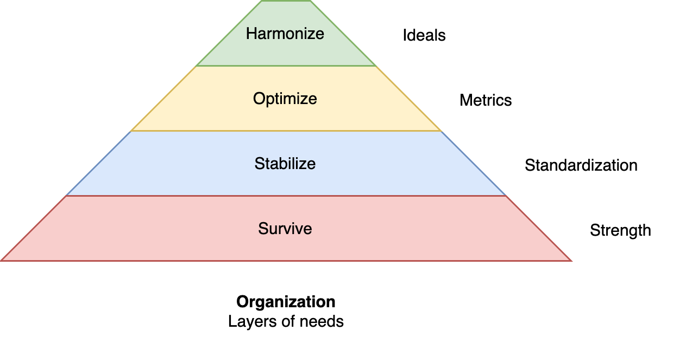

# Lifecycle of Organizations

Organizations tend to follow similar lifecycles. From opening to endgame. See also [product lifecycle](../labour/lifecycle.md).

Each stage in the lifecycle of an organization has challenges.

1. 🌱 Uncertainty of existence. Working to survive. Avoid death.
2. 🪴 Uncertainty of quality. Grow and stabilize. Reduce risk and variability.
3. 🌳 Uncertainty of competition. Market dynamics. Optimize. Overcome old structures and become better than competitors. Collaborate with other organizations. Avoid under-performance.
4. 🍂 Climate. Ideals. Look past direct (short-term) performance and reconsider what maters most.

|      | Uncertainty                 | Aim             | Avoid             | Time horizon   |
| ---- | --------------------------- | --------------- | ----------------- | -------------- |
| 🌱    | Existence                   | Survive         | Death             | Now            |
| 🪴    | Value & growth              | Stabilize, grow | Risk, variability | Potential      |
| 🌳    | Competition & collaboration | Optimize        | Under-performance | Long-term      |
| 🍂    | Sustainability              | Ideals          | Tunnel vision     | Sustainability |

The scale and direction tends to vary. Organizations may have a fractal structure, with sub-organizations that have a different maturity.

These phases can be mapped to a [hierarchy of needs](https://en.wikipedia.org/wiki/Maslow%27s_hierarchy_of_needs). Note the similarity with [individual desires](../psychology/desires.md).

Team productivity and lifecycle.

Organizational evolution.

