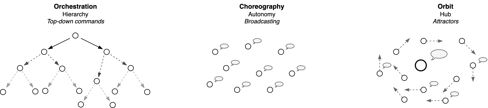
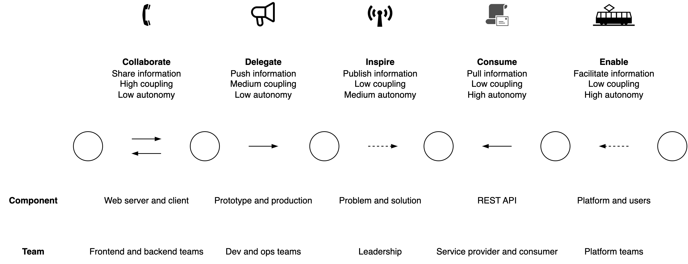

# Relations

A system or organization can be understood as a [network](https://en.wikipedia.org/wiki/Network_theory) of components. In case of a system of agents this provides a social view. See also [scale](organization-scale.md) and [structure](organization-structure.md).

[toc]

## Autonomy and Control

The short-term behaviour of agents in a system determined by their *a priori* configuration and their (local) interaction. Interaction can be driven by demands or individual preferences. These interactions result in [orchestration](https://en.wikipedia.org/wiki/Orchestration_(computing)) and [choreography](https://en.wikipedia.org/wiki/Service_choreography), respectively. The former relies on command-driven communication that are pushed to specific agents. The latter is associated with agents that observe their surroundings and react autonomously.

- Depending on the domain, there is a need for a balance between the two. Too much orchestration can lead to inflexibility. Too much choreography can lead to anarchy or chaos.

|                    | Orchestration                       | Choreography               |
| ------------------ | ----------------------------------- | -------------------------- |
| **Nature**         | Chain of command                    | Autonomous agents          |
| **Centralization** | Central point of influence          | Absence of a central point |
| **Optimized for**  | Execution, transparency, efficiency | Agility, resilience        |
| **Risk**           | Inertia                             | Anarchy                    |
| **Communication**  | *Commands*                          | *Events*                   |

Note that the social structure may change over time.

**Celebrity status**

Real organizations tend to mix these models. A specific form is that of 

- A celebrity that attracts fans, without direct control.
- A solar system with planets that orbit around a sun.

From a networking point of view, the [degree distribution](https://en.wikipedia.org/wiki/Degree_distribution) of these networks is enormously skewed. The celebrity acts as a [hub](https://en.wikipedia.org/wiki/Hub_(network_science)).

**Alignment**

The alignment of agents may change over time. Their behaviour can be flexible or consistent.

### Commands and events

|                 | Command      | Event          |
| --------------- | ------------ | -------------- |
| **Example**     | `doThis`     | `thisHappened` |
| **Orientation** | Future       | Past           |
| **Control**     | Demand       | Assertion      |
| **Direction**   | Peer-to-peer | Broadcasting   |

Communication (commands) may happen *synchronously* - with blocking messages - or *asynchronously*.

Event-based patterns

- See: [publisher-subscriber](https://en.wikipedia.org/wiki/Publish%E2%80%93subscribe_pattern) at the architecture level, [observer](https://en.wikipedia.org/wiki/Observer_pattern) at the application level.
- See the [Saga](https://learn.microsoft.com/en-us/azure/architecture/reference-architectures/saga/saga) pattern.

## Types of Relations

Information can be send in the form of commands, events or requests. It can be send one-to-one or broadcasted. The information can be part of the core domain, it may support the core domain, or it can be generic.

## Power

Decisions are made and forwarded according to a [chain of command](https://en.wikipedia.org/wiki/Command_hierarchy). This power structure may be:

- Explicit or implicit.
- Based on static rules.
- Centralized or distributed.
- Value of individuals in relation to the value of the organization.
- Tight or loose coupled. E.g. by formulating requests based on input, output or outcomes. E.g.
    - *"Execute these steps."*
    - *"Solve this problem by building feature X"*
    - *"Find a way to ensure that a user can achieve Y"*
    - *"We would like to have Z"*

[Power](https://scholar.google.nl/scholar?hl=nl&as_sdt=0%2C5&q=+A+typology+of+organisational+cultures+-+Westrum&btnG=) in organizations can follow several patterns. Based on the flow of information, the following categories can be distinguished.

1. **Authoritative** (pathological): Strive for <u>power</u>. Follow chain of command. Compete for individual gain.
2. **Bureaucratic**: Ensure fairness and resilience through <u>rules</u>. Maintain the status quo. Obey rules and policies.
3. **Generative**: Strive for (group) <u>performance</u>. Be pragmatic and productive. Positive power.
4. **Idealistic**: Prioritize ideals and values over individuals. Shared (higher) purpose.

These categories have the following properties.

|                | Authoritative                       | Bureaucratic                                                 | Generative                              | Idealistic        |
| -------------- | -------------------------------------------------- | ------------------------------------------------------------ | --------------------------------------- | ----------------------------- |
| **Bias** | Power                                     | Rules                                               | Performance                    | Value     |
| **Purpose** | (Individual) Power.                                | Fairness, protection, stability. | Effectiveness, outcomes.                | Follow ideals.             |
| **Type of Power** | Mixed                                              | *Negative* power                                             | *Positive* power                        | Ideals > power                |
| **Responsibility** | Chain of command.                                  | Narrow, but explicit                                         | Shared                                  | Shared                        |
| **Scale**      | Limited                                            | Global                                                       | Global, but unstable                    | Global, but limited cohesion. |
| **Risks**      | Hide information from competitors. Suppress risks. | Slow, difficult to adapt. Bias for status quo. Lack of individual freedom. | Disruptive, unstable. Bias for metrics. | Unrealistic expectations |

Risks to individual freedom.

- In bureaucratic organizations, individual freedom is subordinate to organizational goals and rules.

- In generative (achievement) organizations, individual freedom is subordinate to productivity.

Another extreme is an organic organization. Here, the survival and thriving of the organization is valued more than it's external utility.

**Types of power**

|             | Negative Power       | Positive Power                |
| ----------- | -------------------- | ----------------------------- |
| **Focus**   | Obey rules           | Empowerment to achieve goals  |
| **Utility** | Fair rules           | Resources, to ensure autonomy |
| **Avoid**   | Sins                 | Unproductive thoughts         |
| **Risk**    | Society > individual | Productivity > freedom        |

### Networks

Authoritative power structures tend to be hierarchical and top down. The other structures are more distributed.

