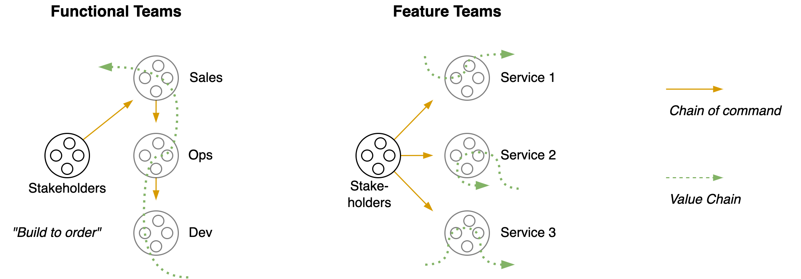
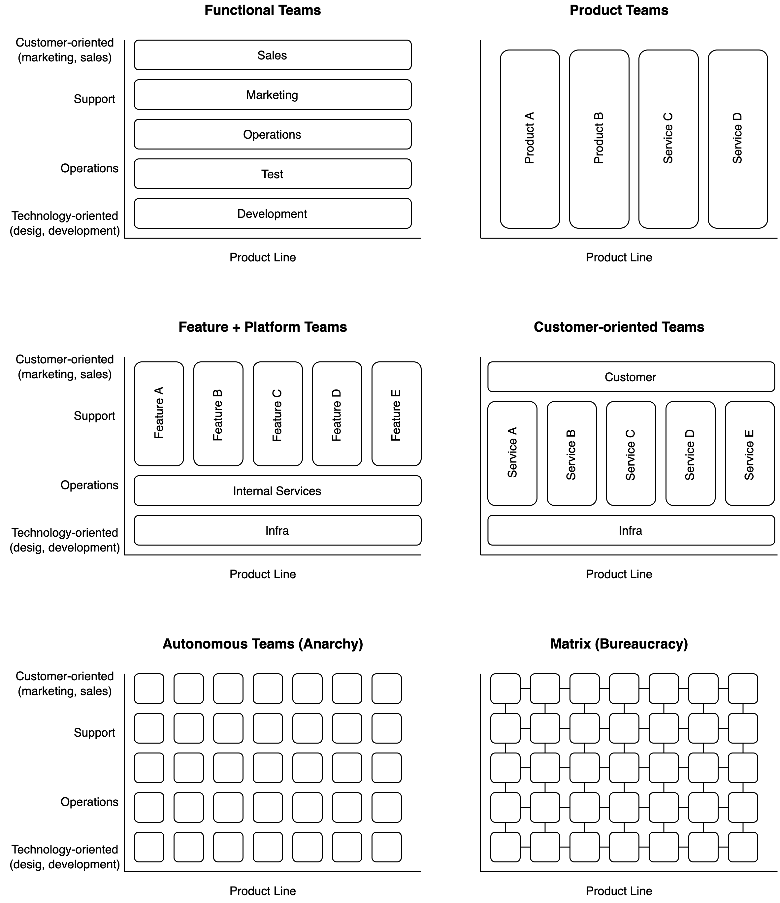

# Organizational Structure

[toc]

## Introduction

Let an **organization** be defined as *an interdependent set of components that work together towards a common goal*.  The alignment, autonomy and coordination of these components complicates the path to the goal.

The optimal structure of an organization is highly dependent on the domain and scale. At the same time, the behaviour of these systems can be surprisingly similar. Examples of organizations are:

- A government
- A company, or a specific department or team within that company
- A software application, consisting of layers such as a user-interface, a business-layer and a database.
- A system of applications, where the components are services.
- An ecosystem. E.g. a market

**Sociotechnical systems**

Often, an organization is multidisciplinary rather than mechanical. Technological decisions have social implications and vice versa. This relation is strengthened by multiple factors. For example:

- Technology may be consumed by humans.
- Technology may be developed through collaboration of multiple teams.
- The scale of the organization in relation to a society.

All these factors should be consider in order to create a sustainable design.

The purpose of an organization can be understood in terms of different parties.

- Owner or **Stakeholders**: the party that profits from success of the organization
- **Customer**: the party that pays to receive a service.
- **Consumers**: the party that uses a service.
- **Employees**: an intermediate party that delivers services.

An organization or system can be understood from different perspectives. See [systems-management](systems-management.md).

- **External** view. A mechanical view of the system as a black box with inputs and outputs.

- **Contextual** view. The positioning of a system within its environment. Side-effects and higher-order consequences of the system.

- **Internal** views. Components, relations and boundaries.

  - Functional view.

  - Information or communication flow.
  - Control flow. How decisions are made.
  - Responsibility or ownership.

**Goals**

An organization may be optimized for a specific goal:

- Adaptiveness, agility.
- Community, e.g. learning [as a whole](https://en.wiktionary.org/wiki/scenius).
- Innovation (transcend the status quo, take risks).
- Productivity (output or outcome).
- Quality
- Resilience
- Scalability
- Stability
- Sustainability, long-term

**Side-effects**

There exist natural forces that disrupt the proper functioning of an organization. The organization adapts itself to changing circumstances. Living and complex systems naturally evolve into disorganization. Active effort has to be put into a system to maintain homeostasis. This can have the form of rules, (updated) plans or a re-organization.

## Topology

### Value Delivery

A [value chain](https://en.wikipedia.org/wiki/Value_chain) is the sequence of activities that are necessary to deliver *value* to the customer. This chain may cross departmental boundaries. If this is the case, then a small change could disrupt multiple departments.

Ideally each component in this chain has a [clear interface](https://en.wikipedia.org/wiki/Interface_segregation_principle). See [systems-management](systems-management.md).

These chains can intersect, based on the types of components in an organization. Ownership and responsibility of the whole value chain may be implicit. There can be independence of decision making and independence of releasing.

### Organizational Scale

Scaling up an organization while maintaining centralized control is inherently difficult. Factors such as autonomy, alignment, control and efficiency may work against each other.

Organizations may grow and adapt. There are a few phases that can be distinguished:

Each component has a *bounded context*. This is an internal, local model. These may include

- A **core** domain. The components that make this organization unique. These <u>provide</u> value.
- **Platforms**. These are generic components that are vital for the functioning of the core domain. These <u>enable</u> value.
- **Contextual** or supporting domains. E.g. interfaces in hexagonal architecture.

**Scaling Agile**

> Agile transformations are done by removing obstacles, rather than by enforcing change.

Achieving high agility of small teams is much simpler that doing it for multiple teams. A few guidelines to do this:

- Scale down. Focus on the core business and outsource the rest.
- Scale out. Divide an organization into independent, autonomous components.
- Scale in. Increase alignment without impeding autonomy. E.g. create a shared vision.

**In IT organizations**

At certain scales, the structure incentivizes **local** optimizations due to the inherent difficulty of making changes that affect other components.

- In functional teams this could lead to strict SLAs and slow handovers.
- In feature teams this can lead to diverging features. This increases duplication.

### Tradeoffs

#### Control and Power

The structure of **control** (power) of an organization can vary between being completely centralized or completely distributed. Communication can vary from being *command*-based to being *event*-based. Furthermore, requests and demands can be output-based or outcome-based.

Two patterns:

- Orchestration: communication happens through a chain of *commands*. E.g. a CEO makes an order.
- Choreography: communication contains many *events*, that are processed autonomously by components. E.g. an investment group broadcasts that they are offering stock at a certain price.

In addition, the communication can happen *synchronously* - with blocking messages - or *asynchronously*.

#### Consistency

**Availability and Consistency**
The flow of information is restricted by at least one of three properties. See [CAP theorem](https://en.wikipedia.org/wiki/CAP_theorem).

- Consistency. Whether newly retrieved information is up-to-date.
- Availability. Whether any request for information is satisfied immediately. Or, how soon a request is satisfied (latency).
- Partition tolerance. How well the system will continue to function in case of component or connection failures.

**Independence and Consistency**
One of the most impactful properties is independence. In software this comes down to modularity. Doing something in isolation and locally is generally easier than at a larger scale, with where multiple components may interact in complex ways. However, independence is associated with [redundancy](http://yosefk.com/blog/redundancy-vs-dependencies-which-is-worse.html). It comes at the cost of consistency.

Two related factors are *alignment* and *autonomy*.

#### Efficiency and Flexibility

These are (to some extend) negatively correlated. Optimizing for efficiency limits flexibility.

This relates to [the bias-variance tradeoff](https://en.wikipedia.org/wiki/Bias%E2%80%93variance_tradeoff) in data science; you can either optimize for a specific situation or adapt to many different situations.

### Autonomy and Alignment

Note that there are multiple paradigms that are theoretically sound. The important part is to be able to adapt at both the organizational- and the team-level.

<b>Alignment &amp; Autonomy</b>

<h4>Power of continuous improvement</h4>

This is a model of an organization with autonommous components. While making local optimizations, each components effectively moves in random directions. With a tiny amount of alignment (vision) the total movement of the system can be altered radically.

<h4>Frameworks</h4>

**By Domain**

Organizations cannot be studied properly without taking into account the domain in which they live. See [learning](../learning.md). See also the  Stacey matrix model.

Four [*domains*](https://en.wikipedia.org/wiki/Cynefin_framework) ordered by structure are:

1. Chaotic. *"Novel practice"*.
    1. Act immediately, then evaluate, then respond. [Triage](https://en.wikipedia.org/wiki/Triage).

2. Complex. *"Emergent practice"*. Learn at the same pace that the environment is changing.
    1. Probe, experiment, then evaluate, then respond.
    1. Suited for "Agile". Focus on learning.

3. Complicated. *"Good practice"*. In absence of a single best practice (golden hammer).
    1. Analyze the problem, then respond.
    1. Suited for "Lean". Focus on optimization.

4. Obvious. *"Best practice"*
    1. Categorize the situation by using existing models.

There are two fundamental dimensions of of influence.

1. Alignment: from flexibility to consistency.
2. Autonomy: from centralized to distributed.

These dimensions are intertwined and the optimum is situational. The following image gives an example of how the level of regulation can affect the value that is produced and delivered. Other properties with similar effects are: overstaffing and up-front planning.

## Interaction

Relations between components can be understood in terms of:

- The direction of relations
- The type of relations

### Type of relations

Decisions are made and forwarded according to a [chain of command](https://en.wikipedia.org/wiki/Command_hierarchy). This power structure may be:

- Explicit or implicit.
- Centralized or distributed.
- Tight or loose coupled. E.g. by formulating requests based on input, output or outcomes. E.g.
  - *"Execute these steps."*
  - *"Solve this problem by building feature X"*
  - *"Find a way to ensure that a user can achieve Y"*

[Power](https://scholar.google.nl/scholar?hl=nl&as_sdt=0%2C5&q=+A+typology+of+organisational+cultures+-+Westrum&btnG=) in organizations can follow several patterns. Based on the flow of information, the following categories can be distinguished.

- **Authoritative** (pathological): chain of command. Based on power and personal need.
  - Hide information from competitors. Suppress risks. Associated with scapegoating.

- **Bureaucratic**: rule-oriented. Based on departmental need. Ensure fairness through equal rules.
  - Narrow responsibility. Local improvements. Associated with seeking justice

- **Generative**: performance-oriented. Welcome inquiry and support global improvements, even if they are disruptive.
  - Shared responsibility. Associated with learning and sharing.

### Direction of relations

> In order to take responsibility, there is a need to be in control.

The direction of dependency / control can be skewed to either:

- The requesting side: orchestration with commands.
- The receiving side: choreography with events.

Ofter there is a need for a balance between the two. Too much orchestration can lead to inflexibility. Too much choreography can lead to anarchy or chaos.

[Orchestration](https://en.wikipedia.org/wiki/Orchestration_%28computing%29)

- **Top-down** control and *command*-driven communication. Messages are **demands** for action.
  - Using **commands** that focus on the *future*. E.g. `doThis`. These are demands for action. They describe an intention of an actor.
  - Domain logic is defined mainly top-down. Messages follow a pre-determined, hierarchical chain. E.g. `A -> B -> C`.
  - Messages (data) are send to specific destinations (peer-to-peer).
    - This can happen *synchronously* or *asynchronously*.

[Choreography](https://en.wikipedia.org/wiki/Service_choreography)

- **Distributed** control and *event*-driven communication. Messages are **assertions**.
  - Using **events** that describe the *past*. E.g. `ThisHasHappened`. These are assertions or facts.
  - Domain logic is defined locally (bottom-up). Components choose autonomously how to react to messages. Responsibility and ownership may be undefined.
    - End-user results are emergent. Changing the system may have side-effects.
  - Messages (data) are broadcasted. They are asynchronous (non-blocking).
  - See: [publisher-subscriber](https://en.wikipedia.org/wiki/Publish%E2%80%93subscribe_pattern) at the architecture level, [observer](https://en.wikipedia.org/wiki/Observer_pattern) at the application level.
  - See the [Saga](https://learn.microsoft.com/en-us/azure/architecture/reference-architectures/saga/saga) pattern.

### Types of Components

#### Hierarchy of Components

A large organization can consists of sub-organizations. E.g. departments, divisions, teams. It is not possible to specialize at every level without impacting cohesion, alignment and collaboration.

This section uses the term "team" instead of "component" for simplicity, but the categories do generalize beyond this. Moreover, different levels typically have a different structures. E.g. functional departments with cross-functional teams.

1. Functional, specialist teams (or departments or roles).
2. Feature or product teams.
3. Core + Context.

**Functional Team**
Focus on either a specific functionality or domain. E.g. a user-interface or a database. Because the team is subordinate to the whole, there is high alignment and low autonomy. There is a uniform user-interface, but every change can affect all components, which limits flexibility of the system.

A typical separation:

- R&D. Focus on innovation. Embrace variance.
- Dev. Deliver unique products.
- Ops. Deliver standardized products. Minimize variance.

Ideally, these teams would collaborate closely, rather than hand-over work.

**Feature or Product Team**
Focus on a product, service, or feature. E.g. a random name generator service. The independence gives the team high autonomy. This increases productivity and flexibility, but the lack of alignment to the whole can lead to over-optimization.

**Core + Context**
This design attempts to avoid the strong coupling of functional teams and the weak alignment of product teams. There are a few variants:

1. A major core component + minor contextual adapters. E.g. a [hexagonal architecture](https://en.wikipedia.org/wiki/Hexagonal_architecture_(software)).
2. A facade (or proxy) + complementing services. E.g. a front for the user, that creates the illusion of uniform system. The complementing services provide the main functionality.
3. Multiple facades.

Note that the facade and the complementing services can be either function-oriented or feature-oriented.

#### Software Organizations

Graphically, this can look like this. The bottom images (autonomy, matrix) are two extremes, where teams are optimized for a local purpose. Depend on the alignment and communication between teams the structure can be rigid.

There are two inherent boundaries between components. Often, each component is responsible (and optimized) for their own domain.

- **Functional** Boundaries. E.g. between dev, ops, sales, marketing, security, compliance.
- **Product** Boundaries. Between products or features.

Local interaction and changes are generally much easier than non local ones.

