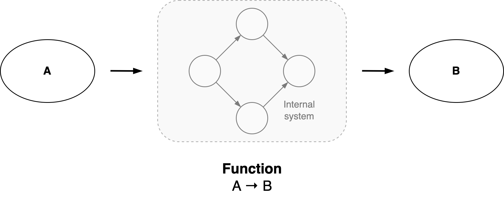

# Organization

Any object can be treated as a *system*: an **organization** what fulfills a *purpose*. A function. This method works recursively. Each component in the system can be understood as a function as well.

[toc]

## Overview

Let an **organization** be defined as *an interdependent set of components that work together towards a common goal*.  The alignment, autonomy and coordination of these components complicates the path to the goal.

The optimal structure of an organization is highly dependent on the domain and scale. At the same time, the behaviour of these systems can be surprisingly similar. Examples of organizations are:

- A government
- A company, or a specific department or team within that company
- A software application, consisting of layers such as a user-interface, a business-layer and a database.
- A system of applications, where the components are services.
- An ecosystem. E.g. a market

See [structure](organization-structure.md).

### Perspectives

Levels

1. **Functional** view. The phenomenon as a function.
2. **Social** view. The interaction of the internal components.
3. **Agent** view. The components themselves. Their lifecycle.
4. **Material** view. The content that a component is made of.

|              | Functional view     | Social view             | Agent view          | Material view             |
| ------------ | ------------------- | ----------------------- | ------------------- | ------------------------- |
| **Focus**    | Context             | System components       | Specific components | Elements of components    |
| **Emphasis** | Purpose             | Interaction & relations | Lifecycle of agent  | Infrastructure for agents |
| **Model**    | Value delivery      | System                  | Application         | Framework                 |
| **Domain**   | Intellectual domain | Social domain           | Biological domain   | Inorganic domain          |

### Functional view

This view focusses on the context of the object, and treats the object itself as a black box.

There are a few common functions.

The purpose of an organization can be understood in terms of different parties.

- Owner or **Stakeholders**: the party that profits from success of the organization
- **Customer**: the party that pays to receive a service.
- **Consumers**: the party that uses a service.
- **Employees**: an intermediate party that delivers services.

**Sociotechnical systems**

Often, an organization is multidisciplinary rather than mechanical. Technological decisions have social implications and vice versa. This relation is strengthened by multiple factors. For example:

- Technology may be consumed by humans.
- Technology may be developed through collaboration of multiple teams.
- The scale of the organization in relation to a society.

All these factors should be consider in order to create a sustainable design.

**Side-effects**

There exist natural forces that disrupt the proper functioning of an organization. The organization adapts itself to changing circumstances. Living and complex systems naturally evolve into disorganization. Active effort has to be put into a system to maintain homeostasis. This can have the form of rules, (updated) plans or a re-organization.

#### Internal goals

An organization may be optimized for a specific goal:

- Adaptiveness, agility.
- Community, e.g. learning [as a whole](https://en.wiktionary.org/wiki/scenius).
- Innovation (transcend the status quo, take risks).
- Productivity (output or outcome).
- Quality
- Resilience
- Scalability
- Stability
- Sustainability, long-term

### Social view

This view focusses on the interaction of the internal components.

A system can be understood in the following dimensions.

- **Individuality**. The set of components can be a *mass* or a pack. The significance of the identity of the individual components.
    - See [scale](organization-scale.md).

- Relations between components. The autonomy of components. See [relations](organization-relations.md).
    - **Control**. Behaviour can arise through [orchestration](https://en.wikipedia.org/wiki/Orchestration_(computing)) or [choreography](https://en.wikipedia.org/wiki/Service_choreography).
    - (Political) **power** can be autocratic or democratic.

