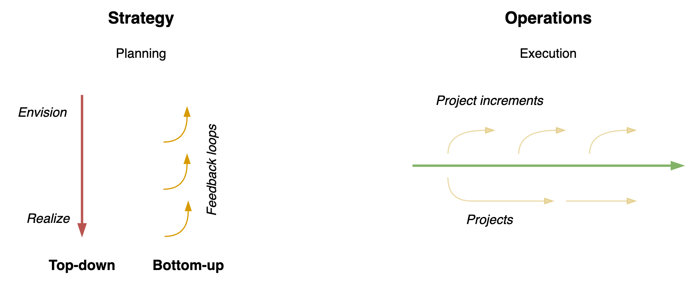

# Relations

A system or organization can be understood as a [network](https://en.wikipedia.org/wiki/Network_theory) of components. In case of a system of agents this provides a social view. See also [scale](scale.md) and [structure](structure.md). See also [functions & relations.md](domain-modelling/functions-relations.md) and personal [relations](../psychology/relations.md).

[toc]

## Structure

In theory, information flows top-down and a bottom-up.

## Autonomy and Control

The short-term behaviour of agents in a system determined by their *a priori* configuration and their (local) interaction. Interaction can be driven by demands or individual preferences. These interactions result in [orchestration](https://en.wikipedia.org/wiki/Orchestration_(computing)) and [choreography](https://en.wikipedia.org/wiki/Service_choreography), respectively. The former relies on command-driven communication that are pushed to specific agents. The latter is associated with agents that observe their surroundings and react autonomously.

- Depending on the domain, there is a need for a balance between the two. Too much orchestration can lead to inflexibility. Too much choreography can lead to anarchy or chaos.

|                    | Orchestration                       | Choreography               |
| ------------------ | ----------------------------------- | -------------------------- |
| **Nature**         | Chain of command                    | Autonomous agents          |
| **Centralization** | Central point of influence          | Absence of a central point |
| **Optimized for**  | Execution, transparency, efficiency | Agility, resilience        |
| **Risk**           | Inertia                             | Anarchy                    |
| **Communication**  | *Commands*                          | *Events*                   |

Note that the social structure may change over time.

**Celebrity status**

Real organizations tend to mix these models. A specific form is that of 

- A celebrity that attracts fans, without direct control.
- A solar system with planets that orbit around a sun.

From a networking point of view, the [degree distribution](https://en.wikipedia.org/wiki/Degree_distribution) of these networks is enormously skewed. The celebrity acts as a [hub](https://en.wikipedia.org/wiki/Hub_(network_science)).

**Alignment**

The alignment of agents may change over time. Their behaviour can be flexible or consistent.

### Commands and Events

Organizational structure can range from hierarchical to flat.

Hierarchies allow commands to be distributed efficiently.

As an example, consider the relations between an employer and thier employees.

**Commands** flow along the hierarchy.

- The employer can give commands to employees. E.g. assignments or priorities.
- The employees can obey or challenge these commands.
- Either can break the contract (hierarchy)

**Messages** can be send in any direction, even between employees. This includes proposals and opinions.

|                 | Command      | Event          |
| --------------- | ------------ | -------------- |
| **Example**     | `doThis`     | `thisHappened` |
| **Orientation** | Future       | Past           |
| **Control**     | Demand       | Assertion      |
| **Direction**   | Peer-to-peer | Broadcasting   |

Communication (commands) may happen *synchronously* - with blocking messages - or *asynchronously*.

Event-based patterns

- See: [publisher-subscriber](https://en.wikipedia.org/wiki/Publish%E2%80%93subscribe_pattern) at the architecture level, [observer](https://en.wikipedia.org/wiki/Observer_pattern) at the application level.
- See the [Saga](https://learn.microsoft.com/en-us/azure/architecture/reference-architectures/saga/saga) pattern.

### Information Sharing

Information can be send in the form of commands, events or requests. It can be send one-to-one or broadcasted. The information can be part of the core domain, it may support the core domain, or it can be generic.

### Networks

Authoritative power structures tend to be hierarchical and top down. The other structures are more distributed.

