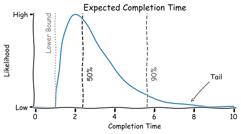

# Systems

This document presents a few models that can be used to understand and deconstruct complex problems in large organizations. See also [goals & strategy](../management/goals-planning-strategy.md).

[toc]

## Introduction

A general form is a **system**. Using a mathematical representation of a system allows us to draw conclusions that generalize to arbitrary domains.

Anything can be described as a system, but the level of uncertainty and control may vary.

A specific type of system is an *organization*, which can be defined as an interdependent set of components that work together towards a common goal. The alignment, autonomy and coordination of these components complicates the path to the goal.

The relevant components in a system are called **resources**. This may include human, computational and mechanical resources. The connections between components vary between domains, but are just as important.

**Types of systems**

- Reactive, stateless
- Stateful, "smart" but functional. E.g. a machine or a top-down organization.
- Ethical. Desiring a goal.
- Generative / autopoiesis. Be able to transform or re-design it's inner structure. Self-sustainable.

## External View

The behaviour of a system can be understood by studying its [inputs and outputs](https://en.wikipedia.org/wiki/IPO_model). This model is agnostic about the inner workings of the system.  Long-term objectives are usually difficult to quantify. In practice, one can use a short-term metric as a proxy for the real objective. E.g. *movement* (associated with energy) or *profit* (associated with money).

The flow of value through a system can be drawn from left to right, whereas the resulting flow of money goes to the opposite direction.

A the system can be decomposed into three mutually exclusive components. Money is used as an example, but this model does generalize to other domains.

- *Input*: money moving into the system (over time). E.g. through sales, or services being delivered to customers.
- *Output*: operational expenses (over time). The cost to turn input inventory into output
- *Inventory*: everything else. Everything in this does not directly (currently) provide value. E.g. throughput.

Be careful not to make the boundary of the system too small, as it will lead to optimization of local optima. More on this [later](#Internal%20View).

Mathematically, the behaviour of a system can be described in several [levels](https://en.wikipedia.org/wiki/Taylor_series) of detail.

0. **Position**. The current state of the system
1. [**Velocity**](https://en.wikipedia.org/wiki/Velocity). The change of the system over time (or space).
2. [**Acceleration**](https://en.wikipedia.org/wiki/Acceleration). How fast the system is changing.

**Alternative systems**

### Inventory

Based on the domain, inventory can include unfinished work, unsold items, buffer, queues, margins of safety. A common role of inventory is to contain [risk](#Risk%20Management). However, inventory has a few inherent disadvantages.

- Inventory has usually a direct cost, and thus can reduce efficiency and relative profitability.
- Inventory tends to deprecate in value over time, for example due to changes in technology or requirements. It can even become obsolete.
- Inventory is often proportional to lead time. For a FIFO-type process, it holds that `E[lead time] = queue size x optimal lead time`.

### Performance Metrics

Using these measurable properties, a universal system-metric would be: `input - output - inventory`. Any choice can be evaluated using this metric: "Is the change going to improve this metric in a given timespan?"

From this definition, it follows that any work that does not contribute towards throughput is either an investment or a complete waste.

> Working on the right thing > investing (e.g. optimizing, learning) > working on the wrong thing (over-producing)

As a complement to this metric, the relative performance can be defined as: `(input - output) / inventory` (where inventory is never zero). This metric highlights the cost of inventory. Beware that it doesn't include absolute profit. Any comparison will have to be adjusted for scale (e.g. thousands or millions).

The future profitability can be defined as the [expected value](https://en.wikipedia.org/wiki/Expected_value) of the first metric: `E[input] - E[output] - E[inventory]`. Naturally, the [risk-adjusted return](https://en.wikipedia.org/wiki/Risk-adjusted_return_on_capital) is obtained by dividing this metric by the variance (or some other proxy for risk).

**Goodhart's law**

> When a measure becomes a target, it ceases to be a good measure.

Suppose that any metrics is imperfect w.r.t a given goal. Then, optimizing for a metric would result in side-effect. These may be adverse to the original goal.

- Faster feedback loops accelerate this. They tend to increase the rate of learning at the risk of local optimization.
- Slower feedback loops are less precise but more stable.

#### Waste & Idle time

Although idle time seems wasteful, it can be a necessity. Types of idle time:

- Idle resources. E.g. firefighters that aren't actively putting out fires.
- Idle tasks. E.g. tasks that are on hold or blocked.

A third category of inefficiency are resources that are doing the "wrong" thing. E.g. producing a product that doesn't have demand.

## Internal View

By definition, the internal components in a systems are either directly or indirectly dependent on each other. Mathematically, a system can be described by a covariance matrix, but this explanation will use a more intuitive, visual model.

### Template: Functional Views

See [BPMN](https://en.wikipedia.org/wiki/Business_Process_Model_and_Notation). Based on events, activities and choices.

<b>Sequence flows and communication flows</b>

 

<b>Ownership</b>

 

<b>Responsibility</b>

 

### Single Chains

This model reduces the system down to direct connections. There are two types: sequential and parallel chains.

In the ideal case, the system has a known clear [critical path](https://en.wikipedia.org/wiki/Critical_path_method). This is the longest dependent chain. In case of multiple chains with the same length the variance can be taken into account. Only in case of equivalence the classification can be made arbitrarily. Optimizations of components in the critical chain are likely to contribute to the global optimum, whereas all other optimizations are merely local.

Resources can be classified as being part of the critical path or not. Resources in the first category can be managed aggressively, focussing on short-term efficiency, whereas other resources can be optimized towards long-term efficiency. Dependent on the flexibility of resources, non-critical resources could even be used to aid critical resources.

### Performance

Improving systems can be done in a few fundamental ways. Note that these require the system to be understand up to a certain extend. Three key concepts are:

0. Discovering the core purpose of the system. Different stakeholders may have varying perspectives. Aligning on this is a prerequisite of successful optimization.
1. Value delivery. The flow from input to output. E.g. the path from development to delivery to end-users.
2. Feedback loops. Find problems as early as possible.
3. Learning. Adapt the system based on experience. Experiment and learn from both success and failure.

 See also [learning.md](../intelligence/learning.md).

#### Effectiveness

A chain may contain unnecessary complexity. On a map, it would look like a meandering river.

Components in a system may differ from each other w.r.t. specific dimensions. E.g.

- Distance to the output of the system.
  - From the perspective of end-users.
  - From the perspective of the provider. E.g. the value that's [added](https://en.wikipedia.org/wiki/Value_added) in each step.
- Level of [commodization](https://en.wikipedia.org/wiki/Commoditization). From novelty to commodity. A product may be completely customized or it can be a commodity. The latter is generally cheaper to outsource.

**Example**

Components of a typical retail value chain. Due to regulation, not all components can be outsourced.

**Changing the Technology**

Changing a process or adapting a new technology may disrupt a system. In order to implement the change as optimally, the system will have to be re-adjusted. In order to decide which components to adapt, ask the following questions:

- What <u>limitation</u> are you tackling?
  - What is the benefit of the new technology?
  - How will it improve our system?
- Which <u>rules</u> have been in place to manage this limitation? *These have to be updated...*
- What are the <u>consequences</u> of those rules and policies? *They can go...*

A few examples:

- Agility: *The introduction of an [ERP](https://en.wikipedia.org/wiki/Enterprise_resource_planning) system will improve estimation and planning. Previously these calculations were done manually, which was time-consuming and thus expensive. As a result, this was done in large batches. Due to their large impact, these batches were verified thoroughly and changing them was forbidden.*
- Inventory: *Due to slow switchovers, production of a specific product is done in large batches. We compete on price by providing discounts based on the size of batches. In order to control delivery times, we have to maintain a high inventory in every region.*
- Efficiency: *This communication technology will allow us to communicate (or ship) within hours. Currently there is no awareness of the quantitive state of our different production centers. Hence, we don't know the exact demand of each state. This uncertainty was countered by a strategy of over-production: i.e. by maximizing resource utilization.*

#### Efficiency

Optimizations based on the current process. This is based by adjusting components within a chain. This excludes radical changes to the chain itself.

**Performance**
Consider that there are two perspectives to view the performance of a system.

- The operational cost of the system. This is a linear sum of all the system's components.
- The flow of value through the system. This consists of the lead time (per item) and the total throughput.

Based on these perspectives, **resource efficiency** can be measured as **resource utilization** and **resource throughput**. Note that neither are perfect metrics. Resource utilization is defined as the proportion of time that a resource is busy. The inverse of utilization is idle time. This can be spare capacity, slack, or a margin of safety in project estimations.

Resources are connected to each other with **queues**. In project management this takes the form inventory or *work in progress (WIP)*.

Resource utilization and queue size (WIP) are interconnected. Suppose that each resource produces as much output as there is demand (e.g. by the next resource in the chain). If queue sizes are increased, each preceding resource has to increase utilization to match the increased demand. If the queue size are decreased, then each preceding resource can work at lower capacity (or work on some other task).

In addition, there are a few important but counter-intuitive effects.

- Adding spare capacity tends to [decrease](https://en.wikipedia.org/wiki/Parkinson%27s_law) resource throughput. This means that incidental delays are not compensated.
  - E.g. the starting slowly because there is plenty to time left.
  - E.g. postponing completion to avoid more aggressive schedules in the future.
- Increasing queue sizes will increase WIP (in project management).
  - This will increase the amount of unfinished work, which will increase handovers, which will decrease system throughput.
  - This will increase pressure, which will increase context switching, which will decrease system throughput.

**Caveat**

Deadlines are not the only method to control pressure. Hence it can be feasible to have loosed deadlines without losing pressure or focus.

##### Bottlenecks

Resources can be categorizes as:

1. Bottlenecks: any resource that has capacity ≤ than the demand placed upon it.
2. Capacity constraint resources. A resource that is on the verge of becoming a bottleneck.
3. Non-bottlenecks. Optimizing these will not improve the flow of the system.

The demand of resources is affected by queue size. Queues can be used as buffers against variance in resource performance. Tasks that go to bottleneck resources typically have high [queue times](https://en.wikipedia.org/wiki/Queue_management_system), while all other tasks have high waiting times.

In theory, idle time of non-bottleneck resources is perfectly fine. This can even be preferable over over-production, which will increase inventory.

##### Propagation of errors

> A chain is no stronger than its weakest link.

A bottleneck or constraint can greatly impact the product of a system. This could result in either poor  or unstable performance. Mathematically speaking, the variance of a system is [equal](https://en.wikipedia.org/wiki/Bienaym%C3%A9%27s_identity) to the sum of the variance of each individual component and the covariances between them. This means that systems with highly dependent (correlated) components suffer from error propagation. The [critical path](https://en.wikipedia.org/wiki/Critical_path_method) is defined as the longest dependent chain.

- A typical example of this is traffic congestion. It is caused by a combination of high utilization and high variance. Counter-intuitively, the only - short-term - mitigation is to decrease the velocity of each car. This will decrease the average variance per car - which indirectly decreases the total variance.

The variance can be described by the following relation.

- `Average` variance per car < `total` variance of the system < `summed` variance of each car (after taking into account the other cars).

Using [Bienaymé's identity](https://en.wikipedia.org/wiki/Bienaym%C3%A9%27s_identity), a general relation can be derived. Let `C` be a set of independent random variables. Then,

where equality holds if the covariances are zero.

The only fundamental way to avoid internal bottlenecks is to *subordinate* all other components to the main bottleneck. E.g. let the majority of components run at partial capacity; build in slack. This requires a system to have more capacity than market demand, resulting in a a tradeoff between having formation of bottlenecks and resource efficiency.

Note that there can also be an external bottleneck. E.g. market demand that is lower than the capacity of the system.

##### Resource Contention

In the aforementioned examples all resources had a static position. However, in reality, resources can shared. In such cases, the critical chain can span over multiple projects.

##### Efficiency & Optimization

> Resource activation does not imply resource utilization.

A system can have many small bottlenecks. Therefore it is useful to distinguish between local inefficiencies and a global one. The latter is called the main constraint of a system.

Two fundamental types of inefficiencies are spare *capacity* (partial utilization) and spare *inventory* (buffers). Reducing them directly can be risky, but improving the system as a whole may reduce them both as a side-effect.

There are two types of efficiency:

- Efficiency of resources. Reduce spare capacity (partial resource utilization).
  - Measured by resource utilization, which is defined as: "The percentage of time the resource is producing something which is contributing to the main goal". This definition excludes the production of e.g. spare parts.
  - Risks: inventory (over-production), over-stretching of resources, over-optimization (silos).
  - Build to sell: build until capacity runs out and then sell inventory to the highest bidder.
- Efficiency of flow (to customer). I.e. [pull-strategy](https://en.wikipedia.org/wiki/Push%E2%80%93pull_strategy), demand-oriented. Because the customer pays for the service.
  - Build to order: pre-define a price range and only build products that are ordered.

Assume that people are never [blocked](https://en.wikipedia.org/wiki/Context_switch) and [always](https://en.wikipedia.org/wiki/Parkinson's_law) busy. Focus on the flow of *tasks*; ensure that they are not blocked. If there is spare capacity, then people can be free to make improvements and learn.

> Low idle time is a side-effect of flow efficiency but not a method of reaching it.

In a *balanced* system, all resources produce exactly the right amount. There is no excess inventory. This theoretical state is dangerous. Any perturbation (expected variance) would be detrimental to flow, because all components are related and depend on each other. This inherent risk can be contained in two fundamental ways:

- Increase inventory. This decreases agility and limits cash flow.
- Decrease batch sizes, which decreases lead time. This increases setup time (handovers).

Having inventory can effect that are not directly financial. For example, owning real estate or vehicles rather than renting them can improve work attitude.

## Runtime

For projects that have a fixed set of requirement and a minimum input effort, the expected time until completion often has the following pattern. For uncertain projects the tail is more pronounced.

