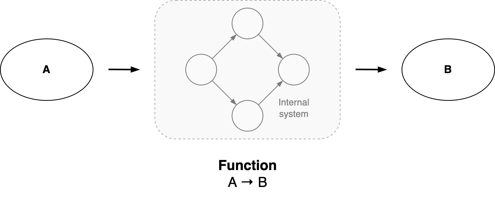
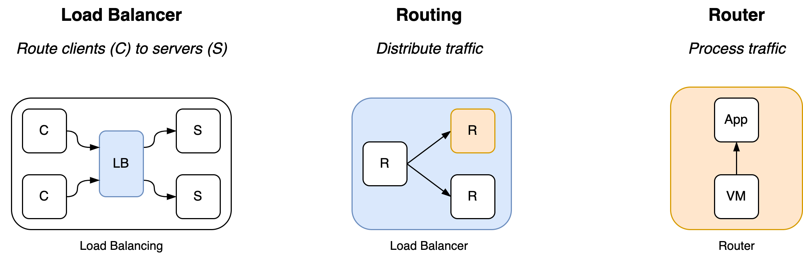
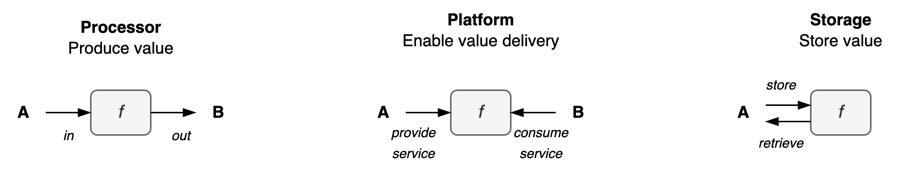

# Sytems

Any object can be treated as a system: an *organization* that fulfills a function.

[toc]

## Overview

Let an **organization** be defined as *an interdependent set of components that work together towards a common goal*.  The alignment, autonomy and coordination of these components complicates the path to the goal.

The structure of organizations can be evolved or manufactured.

|               | Organic Organizations       | Rigid Organizations |
| ------------- | --------------------------- | ------------------- |
| **Purpose**   | Emerged                     | External            |
| **Structure** | Evolution                   | Revolution          |
| **Purpose**   | Inherent, self-preservation | External            |

The optimal structure of an organization is highly dependent on the domain and scale. At the same time, the behaviour of these systems can be surprisingly similar. Examples of organizations are:

- A government.
- A company, or a specific department or team within that company.
- A software application, consisting of layers such as a user-interface, a business-layer and a database.
- A system of applications, where the components are services.
- An ecosystem. E.g. a market.

See [structure](structure.md).


An organization can be

- A [system](../systems/system.md) that has a function. E.g. a machine that consumes resources and produces value.
- A structure that presents information for a specific purpose.


### Unified Perspective

```
object = function = system = organization
```

An **object** can be understood as a **function** with respect to it's context. It can also be understood as a **system** of components that interact in such a way that it fulfills a function.

- This method works recursively. Each component in the system can be understood as a function as well.

This results in the following levels. Based on [domains](../reality/structures.md).

1. **Functional** view. The external purpose of the object.
2. **Social** view. The interaction of the internal components. The structure of the [network](https://en.wikipedia.org/wiki/Network_theory).
3. **Agent** view. The components themselves. Their lifecycle.
4. **Material** view. The content that a component is made of.

|              | Functional view     | Social view             | Agent view          | Material view             |
| ------------ | ------------------- | ----------------------- | ------------------- | ------------------------- |
| **Focus**    | Context             | System components       | Specific components | Elements of components    |
| **Emphasis** | Purpose             | Interaction & relations | Lifecycle of agent  | Infrastructure for agents |
| **Model**    | Value delivery      | System                  | Application         | Framework                 |
| **Domain**   | Intellectual domain | Social domain           | Biological domain   | Inorganic domain          |



#### Double articulation

A function can be said to emerge from a pair of transformations.

1. Assemblage. A set of components are assembled into a system. A system coherent view emerges.
2. Expression. The system fulfills a purpose within a broader context. It's function is expressed in this context

Example: load balancer

- A VM hosts a an application. It's expression is a *router*.
- A set of routers is configured in a network, along with load balancing policies. It's expression is a load balancer.
- A load balancer is connected to real-world servers. It's expression is load balancing of traffic.




### Functional view

This view focusses on the context of the object, and treats the object itself as a black box.

The purpose may range from organic to mechanic.

- Mechanic. A strong, coherent purpose, similar to a machine.
- Organic. Emphasis on the preservation of the organization itself. Understand they system as a living being.

There are a few common *functions*.

- **Processor**. Process information or materials and *transform* them. E.g. components in a value chain.
- **Storage**. Store valuable objects and retrieve them at a later point in *time*.
- **Platform**. *Facilitate* service providers and consumers. See [platform management](../organization/platform.md).



**Context**

The purpose of an organization can be understood in terms of different parties.

- Owner or **Stakeholders**: the party that profits from success of the organization
- **Customer**: the party that pays to receive a service.
- **Consumers**: the party that uses a service.
- **Employees**: an intermediate party that delivers services.

**Sociotechnical systems**

Often, an organization is multidisciplinary rather than mechanical. Technological decisions have social implications and vice versa. This relation is strengthened by multiple factors. For example:

- Technology may be consumed by humans.
- Technology may be developed through collaboration of multiple teams.
- The scale of the organization in relation to a society.

All these factors should be consider in order to create a sustainable design.

**Side-effects**

There exist natural forces that disrupt the proper functioning of an organization. The organization adapts itself to changing circumstances. Living and complex systems naturally evolve into disorganization. Active effort has to be put into a system to maintain homeostasis. This can have the form of rules, (updated) plans or a re-organization.


#### Internal goals

An organization may be optimized for a specific goal:

- Adaptiveness, agility.
- Community, e.g. learning [as a whole](https://en.wiktionary.org/wiki/scenius).
- Innovation (transcend the status quo, take risks).
- Productivity (output or outcome).
- Quality
- Resilience
- Scalability
- Stability
- Sustainability, long-term


### Social view

This view focusses on the interaction of the internal components.

A system can be understood in the following dimensions.

- **Individuality**. The components can be a *mass* or a pack. The significance of the identity of the individual components.
  - See [scale](scale.md).

- **Relations** between components. The autonomy of components. See [relations](relations.md).
  - Control. Behaviour can arise through [orchestration](https://en.wikipedia.org/wiki/Orchestration_(computing)) or [choreography](https://en.wikipedia.org/wiki/Service_choreography).
  - (Political) power can be autocratic or democratic.

The nature of the relations may give rise to emergent properties. E.g. fluid dynamics, swarm behaviour, flocking.
