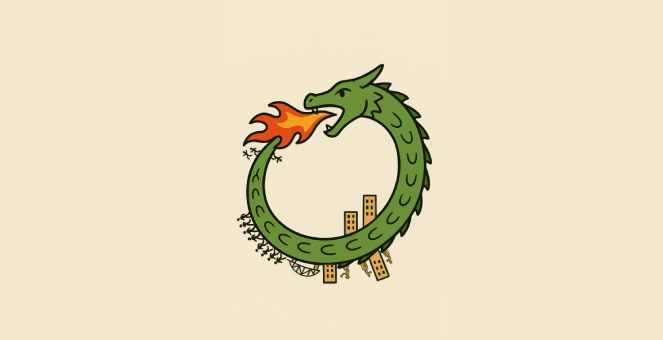
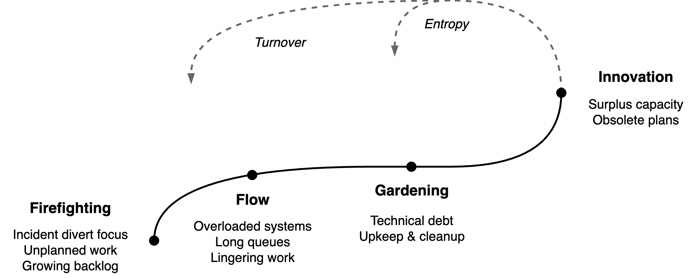
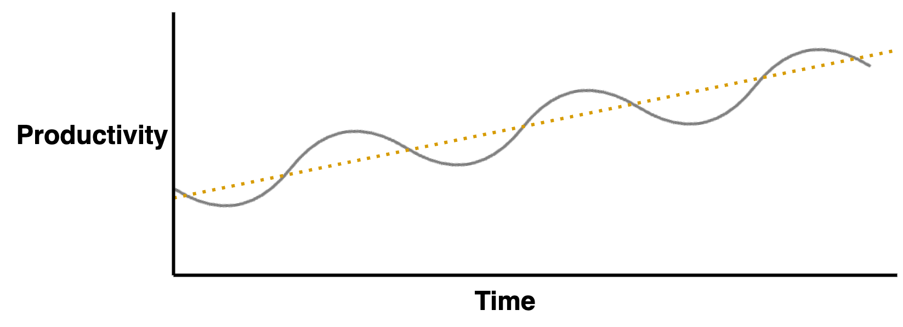

# Team Productivity

This is a model for team productivity. It provides insight into dynamics such as stabilization and innovation. See also team [productivity](team-productivity.md) and [success](success.md).

## Introduction

Teams tend to evolve naturally through periods of instability and growth. Both productivity and value delivery fluctuate throughout these periods. A common approach is to balance the ratio between operations and strategic investment. However, a single ratio provides little control and predictive value. Our model offers a more refined view. It models the progression of productivity as an evolution through distinct challenges, and predicts shifts in priorities and productivity.

The model is derived from the typical challenges faced by teams. Consider a fire brigade as analogy. Ordered by criticallity: recurring fires, traffic congestions, road detours, slack.

|                | 🔥🚒 Fires                                         | 🚗🚗🚗 Congestions              | 🚧 Detours                          | 🧯 Slack                                          |
| -------------- | ------------------------------------------------ | ---------------------------- | ---------------------------------- | ------------------------------------------------ |
| **Constraint** | Too much work, components breaking down          | Too much WIP                 | Too much tech. debt                | Outdated value proposition, lacking capabilities |
| **Signals**    | Recurring incidents,skills gaps, growing backlog | Long queues, dependencies    | Complexity / clutter, workarounds. | Ambition / growing potential                     |
| **Solution**   | Hire more or reduce scope                        | Focus, improve collaboration | Make time                          | Balance expectations                             |

For each constraint, a team may focus on the following solution.

1. 🔥 **Firefighing**. Sprinting towards immediate results. Reacting to incidents. The backlog grows faster than the team can handle.
2. 🔄 **Flow**. Stop starting, start finishing. Freeze backlog and finish WIP together. Reduce waste. Incorporate feedback earlier.
3. 🪴 **Gardening**. Focus on quality, upkeep and cleanup. Pruning. Streamline complexity.
4. 🚀 **Innovation**. Re-adjust value proposition and capabilities. Growing the team scope.

When a team does not commit to solving a single constraint, it might plateau. Likewise, if a team commits to too many constraints, their effort diffused and progress will falter. Ideally, when a team does succesfully lift a constraint it will transition on to a new phase.

## Unsustainable Productivity

The harder a team pushes towards the last phase, the greater the resistance it will encounter. The innovation phase is especially unpredictable, due to its side-effects:

- Natural entropy caused by new tooling, processes or scale. Need to maintain the newly developed tooling.
- Organizational pressure to focus on lower-performing teams. Team members being be re-allocated.
- Performance being penalized by higher expectations or workload.
- External changes that disrupt the team.
- Experimentation being seen as a opportunity to cut costs.

This provides two paths forward.

- Focus on innovation and growth. Plan to evolve the team after a limited period of innovation - and continue with phase 1.

- Be conservative and spend a minority of effort on innovation. Attempt to keep a balance between operations and innovation.

## Long-term Productivity

The instable phases result to a characteristic pattern, not unlike to boom and bust cycles in economics. Over-optimizing for growth and innovation will fail eventually, and result in a period of underperformance.

Another analogy is that of (simulated) [annealing](https://en.wikipedia.org/wiki/Simulated_annealing). This optimization technique alternates stabilization (exploitation) with diversification (exploration). Local optimization is alternated with diversification to improve the global state.
