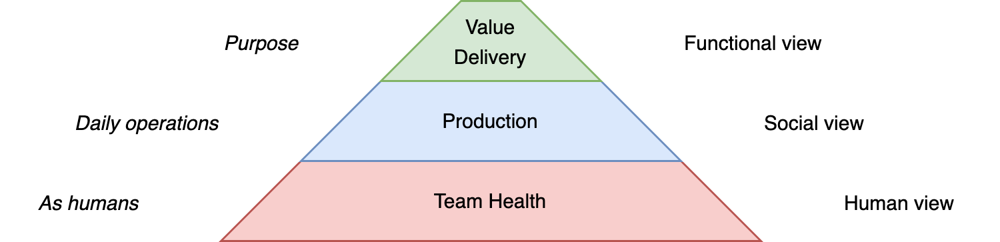
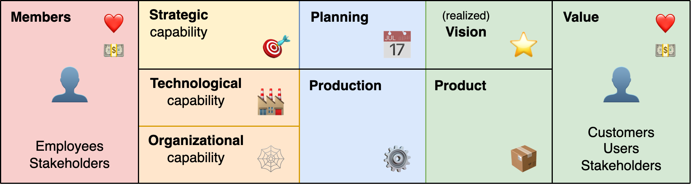
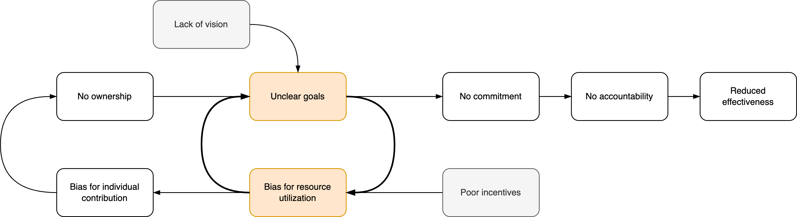

# Teams

A team is a set of players that work together to achieve a shared goal. This overview links to aspects of a team's being and performance.

[toc]

## Overview

A team is composed of several layers.

1. Value delivery. The net result of the team's effort. Their impact.
2. (Social) relations with partners and customers. Sponsors and dependencies. Their position in an organization.
3. Social dynamics within the team. The flow of information and commands. Roles, incentives and individual goals.
4. [Productivity](productivity-constraints.md). Utilization. Completion of tasks
5. The environment.

All of the above are layers are important. Zooming out, the team can be understood through several lenses.

- Team [success](success.md). Whether members want to engage in the team. Whether they feel safe and dare to speak up. See also [trust](trust.md).
- Team [performance](performance.md). Value delivery as result of production and collaboration.
- Team [maturity](maturity.md). Whether the team is stable and works empirically.

From an organizational view, a team touches various areas. See [product management](management/product-management.md).

## Leadership

See [leadership](../alignment/authoritative-surrendered-leadership.md) and [alignment](../alignment/alignment.md).

> Authority implies responsibility.

A leader is both part of the team and an outsider. The role requires the ability to step outside the team and make difficult decisions.

A (servant) leader is not just responsible to lead its followers, but more so to help (facilitate) them. The usefulness of the leader *justifies* their position.

Decision making may happen by agreement, consensus or hierarcy. It can be reactive or pro-active.

## Signals

Signals that indicate what is happening to a team.

1. Look & **feel**. Use intuition.
2. **Listen** to customers, stakeholders and employees.
3. Monitor effectiveness, predictability and efficiency.
4. Reflect on environment-specific factors such as autonomy, maturity, health, motivation, resilience.

**Red flags**

Reflect:

- Is there trust?
- Is conflict acknowledged? How is it addressed?
- Is there a shared goal?
- Is there miscommunication?
- Are risks transparent?

### Anti-patterns

1. A lack of vision results in unclear and diverging goals.
2. Poor incentives promote resource utilization, which results in local optimization.
3. Unclear goals contribute further to a bias resource utilization. This emphasizes (individual) productivity over long-term outcomes.
4. These dynamics make it difficult to make commitments and hold the team accountable.
5. As a result, progress is hampered.

## Other Models

Lencioni model (five dysfunctions of a team)

1. Absence of **trust**. Can team members be open/vulnerable?
2. Fear of **conflict**. Is conflict suppressed?
3. Lack of **commitment**. Dedication.
4. Avoidance of **accountability**. Do team members hold each other accountable?
5. Inattention to - collective - **results**. Versus local/personal results.

Google model. [src](https://rework.withgoogle.com/blog/five-keys-to-a-successful-google-team/)

1. **Psychological safety** – Feeling able to take risks without feeling insecure or embarrassed.
2. **Dependability** – Being able to count on each other to deliver high-quality work on time.
3. **Structure & clarity** – Having clear goals, roles, and plans for each member and the group as a whole.
4. **Meaning of work** – Working on something personally important to each team member.
5. **Impact of work** – The belief that the work being done matters.

T7 Model of Team Effectiveness

- Internal factors
  - Task executed successfully
  - Thrust: common purpose
  - Trust in each other
  - Talent - collective skills
  - Teaming - operate effectively
- External factors
  - Team leader fit
  - Team support from the organization

## Team Persona's

- Old guard. Been around for a while. Is already connected. Conservative.
- New guard. Fresh eyes. Eager. Make new connections. Progressive.
- Senior team member. Interested in planning. Has learned from mistakes.
- Junior team member. Interested in proving themselves. Still has to learn.

Two extremes: [old/new guard](https://twitter.com/johncutlefish/status/1451240735127195650).

| Old Guard                          | New Guard                               |
| ---------------------------------- | --------------------------------------- |
| Preserve influence                 | Expand influence                        |
| Leverages informal networks        | Has still  to creates informal networks |
|                                    |                                         |
| Knows how to navigate the mess     | Sees a mess                             |
| Too much auto-pilot                | Too much cognitive overload             |
| Skeptical: "Yeah, but ..."         | Eager: "So what"                        |
|                                    |                                         |
| Seeking acknowledgement            | Seeking acceptance                      |
| Oriented to long-term improvements | Oriented to short-term improvements     |
| Has stuck despite challenges       | Recently left prior challenges          |
