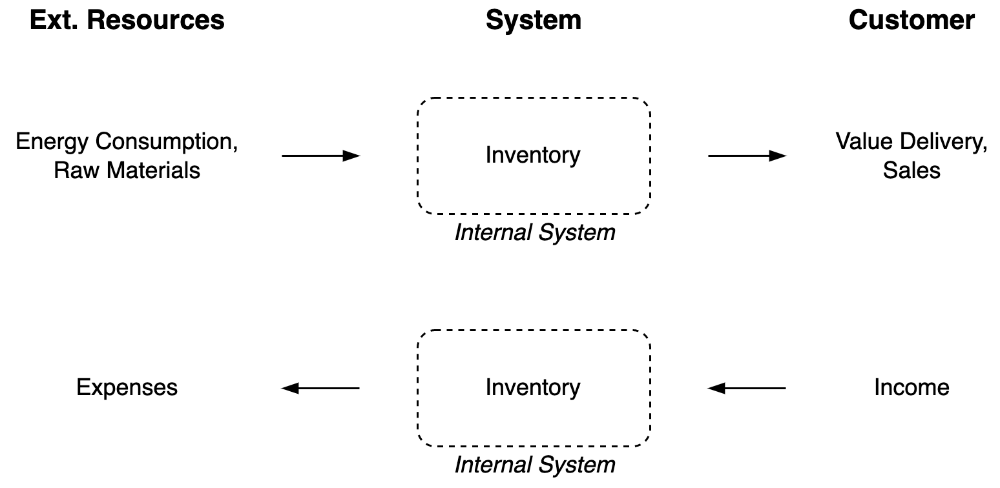
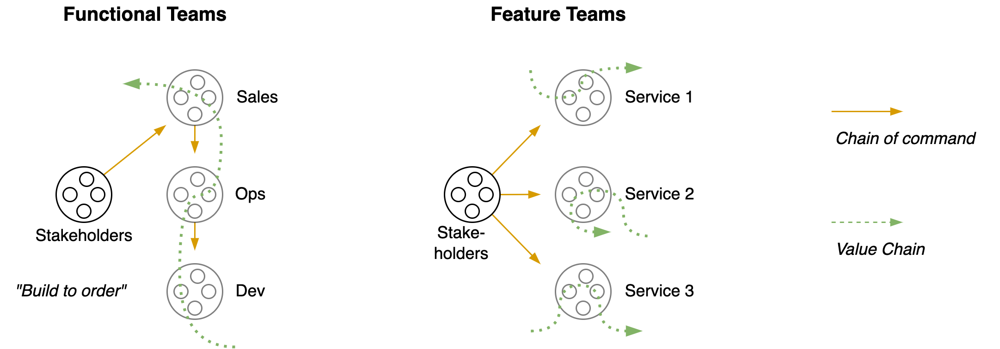
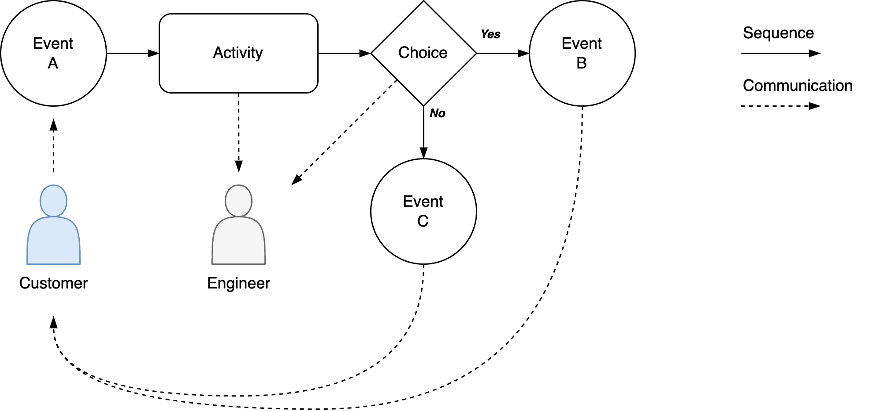
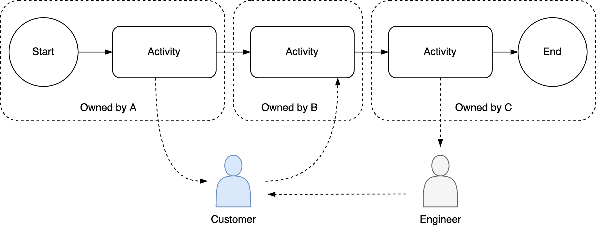
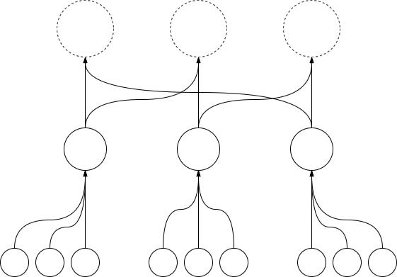
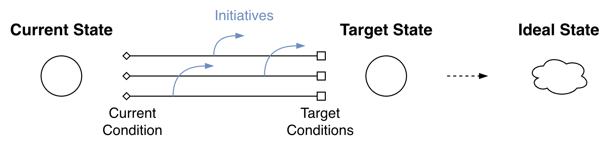
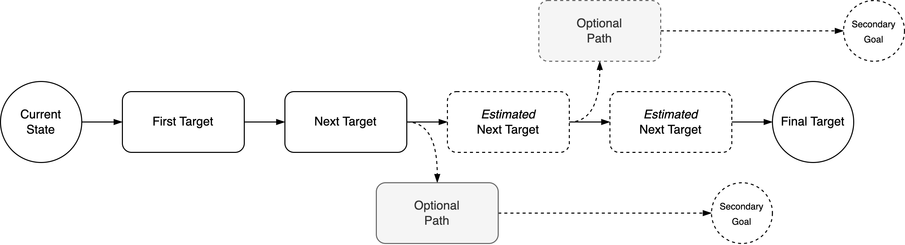
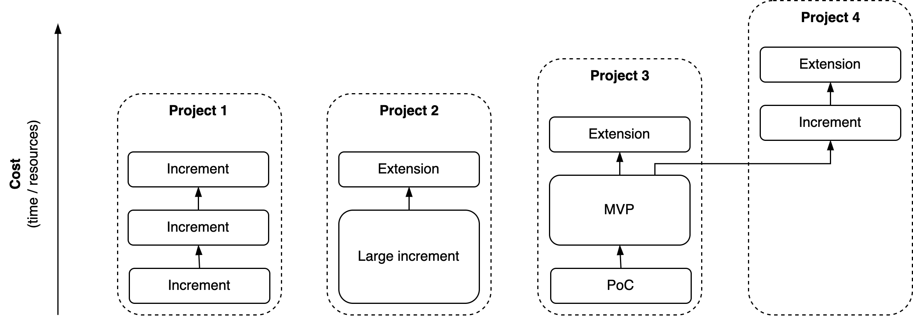
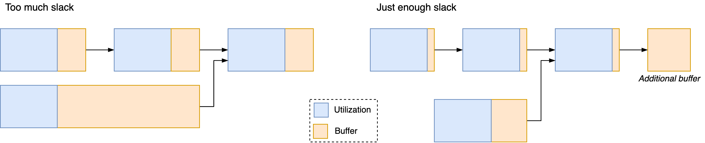
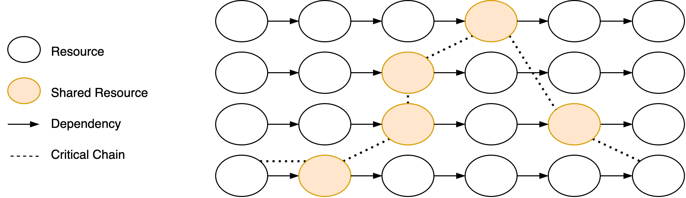

# Planning-related Visuals

[toc]

## Systems

To visualize systems, long-running processes, value chains and pipelines. See also [systems-management](systems/systems-management.md).

### Outside view

System as a black box. Focus on inputs and outputs.



### Inside Views

**Distributed systems**

```markdown
- Compute / domain logic
- Storage / persistency
- Communication between component and the outside.
```

**Value Chain(s)**



**Functional view**

Activities and communication



**Ownership / Responsibility**




**Commoditization of Components**


## Roadmap & Planning

**Goals**









**Kanban Board**


## Processes

**Queues**



**Resource Contention**




