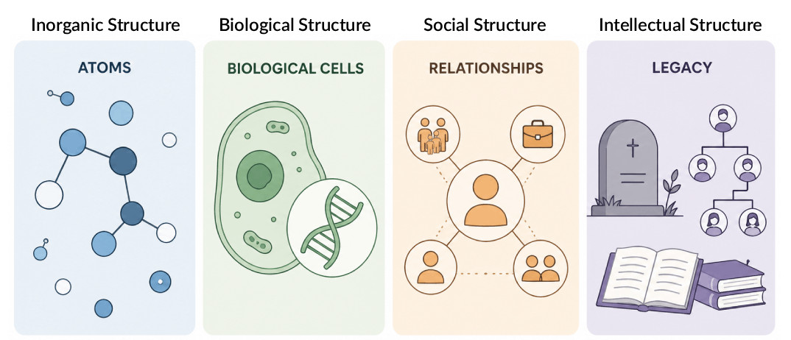

# Visuals

[toc]

## Life

### Tree of life

### Time Allocation

## Quality

#### Four domains

## Organizations

### Lifecycle

### Evolution

### Productivity

### Fiery Dragon

### Fire Brigade

### Team Sizing

### Product Increments

## Communication

### Crossroads (boundaries)

### Deep and surface level conversations

