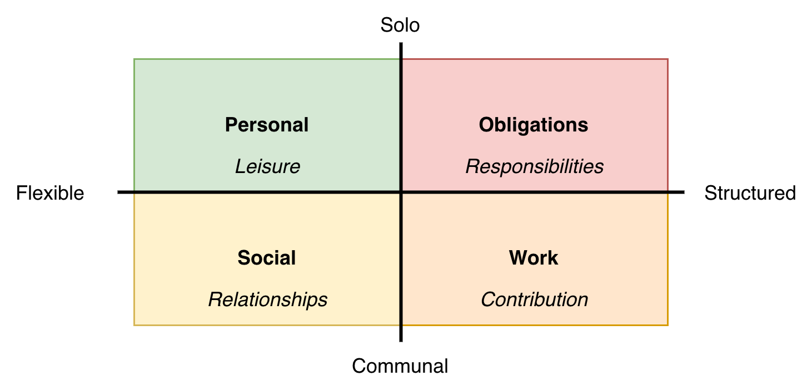
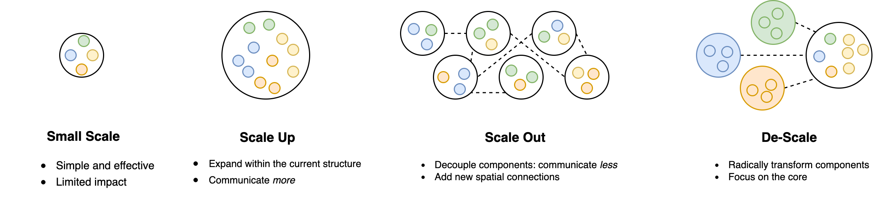
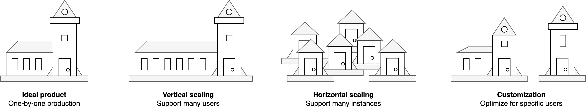
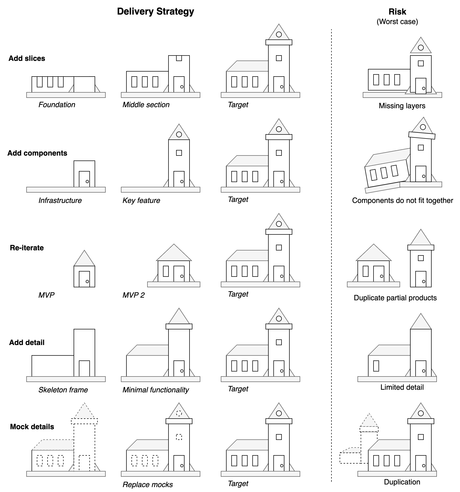

# Visuals

[toc]

## Life

### Tree of life

### Time Allocation

## Quality

## Organizations

### Team Sizing

### Product Increments

## Productivity

### Fiery Dragon

### Fire Brigade

## Communication

### Crossroads (boundaries)

### Deep and surface level conversations

